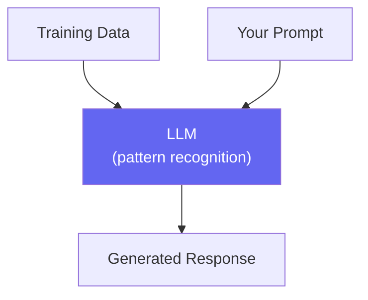
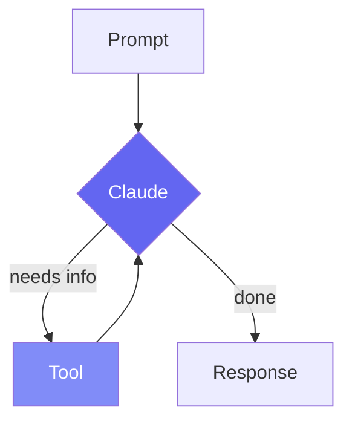

# Session 1: The AI Coding Revolution

Week 1 · Non-Technical · 60 min

<!--
This is the opening session for the whole company—execs, PMs, designers, QA, and developers alike. No technical background required. We start from the very beginning: what is an LLM, how did we get from ChatGPT to coding agents, what is Claude Code, and why it matters for the business. By the end, everyone should understand what AI-assisted development is and isn't.
-->

---
layout: section
---

# What is an LLM?

A 5-minute explainer, no jargon

<!--
Let's start at the very beginning. Even if you've used ChatGPT, understanding what's under the hood helps you use these tools better. We'll keep this simple and visual.
-->

---

# What is a Large Language Model?

<div class="grid grid-cols-2 gap-8">
<div>

### The simplest explanation

An LLM is a program that **predicts the next word** — trained on billions of documents from the internet (books, code, tutorials).

- It "knows" programming languages, frameworks, patterns
- It can follow instructions in plain English
- It doesn't "think" — it **pattern-matches** at scale

</div>
<div>



</div>
</div>

| Property | What it means |
|----------|--------------|
| **Trained, not programmed** | Learned from examples, not rules |
| **Probabilistic** | Can give different answers each time |
| **No memory** | Forgets between conversations |
| **Context window** | Limited "working memory" per session |

<!--
Think of an LLM as the world's most well-read intern. It has read essentially everything on the internet—every coding tutorial, every Stack Overflow answer, every programming book. It doesn't truly understand code the way a human does, but it recognizes patterns incredibly well. When you ask it to write code, it's drawing on millions of examples it learned during training.
-->

---

# From ChatGPT to Coding Agents

<div class="timeline pt-4">
<div class="timeline-item">

**2022 — ChatGPT** · Chat interface, copy-paste code snippets

</div>
<div class="timeline-item">

**2023 — GitHub Copilot** · Autocomplete inside your editor, line by line

</div>
<div class="timeline-item">

**2024 — Cursor, Windsurf** · AI-aware editors, multi-file edits

</div>
<div class="timeline-item">

**2025 — Claude Code, Codex CLI** · **Coding agents** — AI that reads, writes, runs, and verifies code autonomously

</div>
</div>

<br>

> The shift: from **"AI suggests a line"** to **"AI completes a task"**.

<!--
This is the evolution over just three years. ChatGPT could generate code, but you had to copy-paste it. Copilot autocompletes inside your editor. Cursor and Windsurf can edit multiple files. Claude Code is the next step: a coding agent that can read your project, make decisions about what to do, run commands, and verify its own work. It doesn't just suggest—it acts.
-->

---

# What is Claude Code?

<div class="grid grid-cols-2 gap-8">
<div>

### A coding agent in your terminal

**Anthropic's command-line tool** that turns Claude into a hands-on developer:

1. **Reads** your code to understand the project
2. **Plans** what changes to make
3. **Edits** files following your patterns
4. **Runs** tests and commands to verify
5. **Asks** before doing anything risky

```bash
claude
> Fix the login timeout bug in auth/session.ts
```

</div>
<div>

### How it works

> You describe a task → Claude Code reads your code, edits files, runs tests → You approve

### It's NOT

- Not a chatbot (it takes **actions**)
- Not autocomplete (it makes **decisions**)
- Not autonomous (you're **always in control**)

</div>
</div>

<!--
Claude Code is different from ChatGPT or Copilot. It's an agent—it doesn't just answer questions or suggest code. It reads your files, makes a plan, edits code, runs tests, and checks its work. And crucially, it asks for your approval before doing anything destructive. You're always in the driver's seat.
-->

---

# The Agentic Loop

<div class="grid grid-cols-2 gap-8">
<div>

### How every interaction works

1. **You** write a prompt (in English)
2. **Claude** decides what tools to use
3. **Claude** reads files, runs commands, edits code
4. **You** review the results — **Repeat** until done

An **agentic loop**: Claude decides what to do next, not just what text to generate.

### Chatbot vs Agent

- Chatbot answers questions → Agent **completes tasks**
- You copy-paste code → Agent **edits files directly**
- One response → **Multiple steps, self-correcting**

</div>
<div>



</div>
</div>

<!--
The important insight: Claude Code isn't just answering questions. It's making decisions about which files to read, what commands to run, and how to verify its work. Each tool call gives it new information that influences its next step. Understanding this loop helps everyone—even non-developers—understand what's happening when Claude Code is working.
-->

---

# Prompting: From Chat to Agent

<div class="grid grid-cols-2 gap-8">
<div>

### Chat-style vs Agent-style

| Chat-style (less effective) | Agent-style (more effective) |
|---------------------|-------------------|
| "How do I validate email?" | "Add email validation to the signup form" |
| "Write a React component" | "Add a `<UserCard>` component matching the existing Card patterns" |
| Generic, conversational | **Specific, actionable, with context** |

</div>
<div>

### The prompt formula

```
[Action] + [Where] + [Constraints]
```

**Vague**: *"Fix the bug"*

**Specific**: *"Fix the login timeout in auth/session.ts — the TTL should come from the config, not be hardcoded."*

### Why specificity matters

- Less time wasted exploring the project
- Better results on the first attempt
- Claude checks its work against your constraints

</div>
</div>

> Think of it like writing a task for a contractor — the better the spec, the better the result.

<!--
The single biggest mistake people make is prompting Claude Code like ChatGPT. Chat-style prompts lead to generic output. Claude Code prompts should be specific, with file paths and constraints. This applies to everyone—even non-developers can write great prompts by being specific about what they want changed and where.
-->

---

# Real Before & After

<div class="grid grid-cols-2 gap-4">
<div>

### Before (vague prompt)

```
> Add user authentication

Claude: Let me look at the project...
[reads 15 files trying to understand structure]
[picks a random auth library]
[creates files in wrong directories]
[doesn't follow project conventions]

Result: Works, but doesn't match
your patterns. 20 min wasted.
```

</div>
<div>

### After (specific prompt + CLAUDE.md)

```
> Add JWT auth middleware to api/routes
  using jose library. Follow the pattern
  in api/middleware/cors.ts.

Claude: I see your middleware pattern.
[reads 2 files, understands structure]
[follows existing patterns exactly]
[adds tests matching test/ conventions]

Result: Production-ready in 3 min.
```

</div>
</div>

> The difference isn't Claude's capability — it's **your input**. Same model, 10x better output.

<!--
This before/after shows that the model is the same—what changes is the quality of input. Specific prompts with file paths and conventions produce dramatically better output. CLAUDE.md eliminates the "discovery" phase entirely. We'll cover CLAUDE.md in detail next.
-->

---

# CLAUDE.md — The Highest-ROI 5 Minutes

<div class="grid grid-cols-2 gap-8">
<div>

### What is it?

A **markdown file** in your project that Claude reads automatically at the start of every session. It tells Claude about your project.

```markdown
# CLAUDE.md
## Project Structure
- Frontend: Next.js in `src/`
- Backend: Express API in `api/`
## Conventions
- TypeScript strict mode
- `for...of` over `.forEach()`
## Commands
- `npm run dev` — dev server
- `npm test` — run tests
```

</div>
<div>

### Why it matters

- **Without**: 20-30% of time wasted rediscovering the project
- **With**: Claude starts immediately with correct patterns
- Under **200 lines**: 92%+ rule application
- Over 400 lines: drops to ~71%

### Think of it as...

> An **onboarding document for AI**. What would a new team member need to know in their first hour? That's what goes in CLAUDE.md.

Every team member benefits from the same CLAUDE.md — it travels with the repo.

</div>
</div>

<!--
CLAUDE.md is the single most impactful thing you can do. It's a markdown file in your repo root that Claude reads automatically every session. Tell it about your project structure, coding conventions, and key commands. The whole team benefits. Keep it concise—under 200 lines is the sweet spot.
-->

---

# Business Value — For the Whole Team

<div class="grid grid-cols-3 gap-6 pt-4">

<div class="stat-card">
  <div class="number">2-5x</div>
  <div class="label">Faster prototyping</div>
</div>

<div class="stat-card">
  <div class="number">40%</div>
  <div class="label">Less boilerplate time</div>
</div>

<div class="stat-card">
  <div class="number">5-30x</div>
  <div class="label">ROI per developer</div>
</div>

</div>

<div class="grid grid-cols-2 gap-8 pt-8">
<div>

### Productivity
- Generate tests, docs, boilerplate in seconds
- Onboard to unfamiliar codebases faster
- Debug with an always-available pair programmer

</div>
<div>

### Quality & Knowledge
- Consistent code style via automated rules
- Institutional memory that doesn't leave when people do
- Code review assistant catches common issues

</div>
</div>

<!--
For executives: this is about productivity AND knowledge retention. When a senior developer leaves, their knowledge usually leaves too. With the right setup, that knowledge is captured in the system. For developers: a tireless pair programmer. For designers: you'll be able to prototype and make code changes directly. For QA: consistent test generation and bug investigation.
-->

---

# What Claude Code is NOT

<div class="grid grid-cols-2 gap-8 pt-4">
<div>

### It is NOT
- A replacement for developers or designers
- Autonomous/unsupervised production code
- Perfect or infallible
- A security risk (you control permissions)
- Magic (it makes mistakes!)

</div>
<div>

### It IS
- A powerful productivity multiplier
- A pair programmer that never gets tired
- A knowledge bridge between sessions
- A tool that requires human judgment
- Getting better every month

</div>
</div>

<br>

> AI amplifies **good specs**. It also amplifies **bad ones**.
> The teams getting the most value invest 40-50% of their time planning and specifying tasks **before** prompting.

<!--
This is critical to set expectations for the whole company. Claude Code is a tool, not a replacement. It amplifies what you can do—but it also amplifies mistakes if you give it bad instructions. The teams getting the most value front-load planning and specification before prompting.
-->

---
layout: section
---

# Prerequisites: Get Your Machine Ready

Install these before Session 2 — ask a developer neighbor for help!

<!--
Before we go further, let's make sure everyone can install the tools they need. These are one-time setup steps. If you already have Node.js and Docker, you're good. If not, follow along now or do it as homework before Session 2.
-->

---

# Install Node.js (via nvm)

<div class="grid grid-cols-2 gap-8">
<div>

### What is nvm?

**nvm** (Node Version Manager) lets you install and switch between Node.js versions without admin rights. It's the recommended way to install Node.js.

### macOS / Linux

```bash
# Install nvm
curl -o- https://raw.githubusercontent.com/nvm-sh/nvm/v0.40.1/install.sh | bash

# Close and reopen your terminal, then:
nvm install 22    # Install Node.js 22 (LTS)
nvm use 22        # Activate it

# Verify
node --version    # Should show v22.x.x
npm --version     # Should show 10.x.x
```

</div>
<div>

### Windows

```powershell
# Option A: nvm-windows (recommended)
# Download installer from:
# github.com/coreybutler/nvm-windows/releases
# Run the .exe, then in a new terminal:
nvm install 22
nvm use 22

# Option B: Direct install
# Download from nodejs.org (LTS version)
# Run the installer
```

### Verify it worked

```bash
node --version   # v22.x.x or higher
npm --version    # 10.x.x or higher
```

> Need help? Raise your hand — or ask in **#ai-workspace**.

</div>
</div>

<!--
nvm is the best way to install Node.js because it doesn't require admin privileges and lets you switch versions easily. macOS and Linux users run a single curl command. Windows users download the nvm-windows installer. If you already have Node.js 18 or higher, you're fine—no need to reinstall.
-->

---

# Install Docker Desktop

<div class="grid grid-cols-2 gap-8">
<div>

### What is Docker?

Docker runs **containers** — lightweight isolated environments. We use it for the **Qdrant** vector database that powers session memory search.

### Install

| OS | How |
|-----|-----|
| **macOS** | Download from [docker.com/products/docker-desktop](https://www.docker.com/products/docker-desktop/) |
| **Windows** | Download from [docker.com/products/docker-desktop](https://www.docker.com/products/docker-desktop/) (requires WSL2) |
| **Linux** | `sudo apt install docker.io docker-compose` or use the Docker repo |

</div>
<div>

### After installing

```bash
# Start Docker Desktop (macOS/Windows)
# Just open the app — it runs in the background

# Verify
docker --version          # Docker version 27.x
docker compose version    # Docker Compose v2.x

# Test it works
docker run hello-world
```

### Is Docker required?

**No.** Docker is optional — it's only needed for the session memory features (Qdrant vector database). You can use the workspace without it.

> Install it now if you can. If your machine doesn't support it, don't worry — you'll still follow along fine.

</div>
</div>

<!--
Docker Desktop is a one-click install on macOS and Windows. Linux users can install via apt or the Docker repository. After installing, just open the app—it runs in the background. Docker is optional for the workspace, but recommended if you want the session memory search features we'll cover in Session 5. If you can't install Docker (company policy, old hardware), that's fine.
-->

---

# Install Claude Code

```bash
# With Node.js installed, this is one command:
npm install -g @anthropic-ai/claude-code

# Verify
claude --version
```

### First run

```bash
# Navigate to any project folder
cd your-project

# Start Claude Code
claude
```

Claude Code will prompt you to **authenticate** (API key or OAuth) on first run.

<div class="grid grid-cols-3 gap-6 pt-2">
<div>

**Requirements**
- Node.js 18+
- Anthropic API key or Claude Max subscription

</div>
<div>

**Works in any terminal**
- VS Code terminal
- iTerm / Terminal.app
- Windows Terminal

</div>
<div>

**IDE integrations**
- VS Code extension
- JetBrains terminal
- Neovim plugin

</div>
</div>

<!--
With Node.js installed, Claude Code is a single npm command. On first run it asks you to authenticate—either with an Anthropic API key or a Claude Max subscription. It works in any terminal, no special IDE needed. If you have trouble, the most common fix is making sure your Node.js version is 18 or higher.
-->

---
layout: center
---

# Live Demo

### Seeing Claude Code in Action

<div class="grid grid-cols-5 gap-6">
<div class="col-span-2 text-gray-400 pt-2">

1. Start Claude Code — show the terminal
2. Give it a simple task — watch it read, plan, edit
3. Show the **before/after** of adding CLAUDE.md
4. You're **always in control** — approve/deny actions

</div>
<div class="col-span-3 flex items-center justify-center">


</div>
</div>

<!--
[LIVE DEMO] Start Claude Code in a project without CLAUDE.md and give it a simple task—point out how much time it spends discovering the project. Then add a CLAUDE.md and repeat the same task—show the dramatic improvement. Emphasize the permission model: Claude asks before doing anything risky.
-->

---

# Homework: Install & Try It

<div class="grid grid-cols-2 gap-8">
<div>

### Step 1: Install prerequisites (10 min)

Complete these **before Session 2**:

1. **Install nvm + Node.js** (if not installed):
   ```bash
   # macOS/Linux
   curl -o- https://raw.githubusercontent.com/nvm-sh/nvm/v0.40.1/install.sh | bash
   nvm install 22

   # Windows: download nvm-windows from GitHub
   ```
2. **Install Docker Desktop** (optional but recommended):
   - Download from [docker.com](https://www.docker.com/products/docker-desktop/)
3. **Install Claude Code**:
   ```bash
   npm install -g @anthropic-ai/claude-code
   ```

### Step 2: Try it (5 min)

- Start Claude Code in any project: `claude`
- Ask it to **explain a file** you're curious about

</div>
<div>

### For developers
- Create or improve your project's `CLAUDE.md`
- Try specifying exact file paths in your prompts
- Notice the difference with and without CLAUDE.md

### For designers, QA & PMs
- Don't worry about the terminal — just try it once
- Ask Claude to explain something in plain English
- If you get stuck installing, ask in **#ai-workspace**

### Discussion question

> *"If you could have an AI assistant do one tedious task for you every day, what would it be?"*

Write your answer down — we'll revisit it in Session 3.

</div>
</div>

<!--
The most important homework is getting the prerequisites installed before Session 2. nvm + Node.js is required. Docker is optional but recommended. If anyone gets stuck, point them to #ai-workspace. Developers should also try writing a CLAUDE.md.
-->

---
layout: section
---

# Q&A

Session 1 of 11 complete · **Next**: How Claude Code Works

<!--
Open the floor for questions. Common questions: "How much does it cost?" (Token-based, covered in Session 2), "Is our code sent to the cloud?" (Yes, to Anthropic's API, but not stored for training), "Can it work with any language?" (Yes, any programming language), "Do I need to be a developer?" (No—we'll show non-dev workflows in later sessions).
-->
