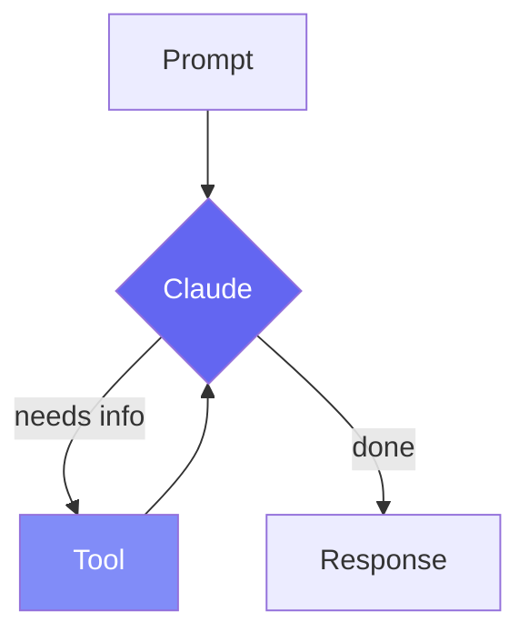
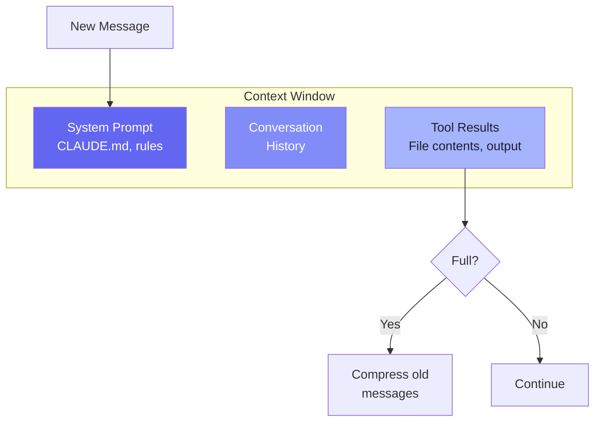

# Session 2: How Claude Code Works

Week 1 · Non-Technical · 60 min

<!--
This session peels back the curtain on how Claude Code actually works. We'll look at the conversation loop, the tools it uses, the context window, and the permissions model. Still fully accessible to non-developers—no coding required to follow along.
-->

---

# The Conversation Loop

<div class="grid grid-cols-2 gap-8">
<div>

Every interaction follows this cycle:

1. **You** write a prompt (in English)
2. **Claude** thinks about what to do
3. **Claude** uses tools (read files, run commands)
4. **You** see the results
5. **Repeat** until the task is done

This is called an **agentic loop** — Claude makes decisions about what tools to use and in what order.

</div>
<div>



</div>
</div>

<!--
The key insight: Claude Code doesn't just answer questions. It makes decisions. It reads a file, realizes it needs to check another file, reads that one, then makes an edit. It's an agent, not a chatbot. Each tool call gives it new information that influences its next step.
-->

---

# The Tool Belt

Claude Code has access to specialized tools for interacting with your codebase:

<div class="grid grid-cols-3 gap-4 pt-4">

<div>

### Reading
| Tool | Purpose |
|------|---------|
| **Read** | View file contents |
| **Glob** | Find files by pattern |
| **Grep** | Search file contents |

</div>

<div>

### Writing
| Tool | Purpose |
|------|---------|
| **Write** | Create new files |
| **Edit** | Modify existing files |
| **NotebookEdit** | Edit Jupyter cells |

</div>

<div>

### Executing
| Tool | Purpose |
|------|---------|
| **Bash** | Run shell commands |
| **Task** | Spawn sub-agents |
| **WebFetch** | Read web pages |

</div>

</div>

<br>

> Claude chooses tools automatically based on the task. You never need to tell it which tool to use.

<!--
These tools are how Claude interacts with the real world. When it "reads a file," it's using the Read tool. When it "runs tests," it's using Bash. The model decides which tool to use based on what it needs to accomplish. This is what makes it an agent—it has agency to choose actions.
-->

---

# The Context Window

<div class="grid grid-cols-2 gap-8">
<div>

### What Claude "sees"

The **context window** is Claude's working memory — everything it can consider at once.

- System instructions (CLAUDE.md, skills)
- Conversation history (your messages + its responses)
- Tool results (file contents, command output)
- Everything has a **token cost**

### The key limitation

When the context fills up, older messages get **compressed** automatically. Claude forgets details from earlier in the conversation.

</div>
<div>



</div>
</div>

<!--
Think of the context window like a desk. You can only have so many papers spread out at once. When the desk is full, you stack some papers aside—you remember they existed, but lose the details. This is why long sessions can sometimes lose track of earlier decisions. It's also why the workspace's session memory system is so valuable—it's like a filing cabinet you can search.
-->

---

# CLAUDE.md — Project Knowledge

The `CLAUDE.md` file gives Claude persistent knowledge about your project:

```markdown
# CLAUDE.md

## Project Structure
- Frontend: Next.js app in `src/`
- Backend: Express API in `api/`
- Tests: Jest + Playwright in `tests/`

## Conventions
- Use TypeScript strict mode
- Prefer `for...of` over `.forEach()`
- All API routes need authentication middleware

## Commands
- `npm run dev` - Start development server
- `npm test` - Run all tests
- `npm run lint` - Check code quality
```

This file is loaded into Claude's context at the start of **every** conversation.

<!--
CLAUDE.md is the single most impactful thing you can do to improve Claude Code's output. It's like an onboarding document for a new developer. Tell Claude about your project structure, coding conventions, key commands, and any gotchas. Every team should have a CLAUDE.md in their repos.
-->

---

# The Permissions Model

Claude Code has a layered permission system:

<div class="grid grid-cols-2 gap-8 pt-4">
<div>

### Permission levels

| Action | Permission |
|--------|-----------|
| Read files | Always allowed |
| Search code | Always allowed |
| Edit files | Requires approval* |
| Run commands | Requires approval* |
| Delete files | Always asks |
| Git push | Always asks |

*Can be auto-approved in settings

</div>
<div>

### What this means

- Claude **cannot** push code without your OK
- Claude **cannot** delete files without asking
- Claude **cannot** run dangerous commands silently
- You choose how much autonomy to grant

### The trust spectrum

```
Manual ←——————————→ Autonomous

Review     Auto-approve    Full auto
every      reads/writes    (experts
action     ask for bash    only)
```

</div>
</div>

<!--
This is important for security-conscious teams. Claude Code is designed with a permission model. By default, it asks before making changes. You can relax this for trusted operations like reading and writing files, while keeping manual approval for things like git push or running scripts. You're always in control.
-->

---

# Walking Through a Real Session

```
User: Add input validation to the signup form

Claude: Let me read the current implementation.

[Read] src/components/SignupForm.tsx           ← Read
[Read] src/lib/validation.ts                   ← Read

I'll add email, password, and name validation.

[Edit] src/lib/validation.ts                   ← Edit
  + validateEmail(), validatePassword()

[Edit] src/components/SignupForm.tsx            ← Edit
  + import validators, add error state

[Bash] npm test -- --grep "signup"             ← Bash
  ✓ 8 tests passed

Done! Email format, password strength, name checks.
```

> Pattern: **Read** → plan → **Edit** → **Verify**. Claude understands the codebase before making changes.

<!--
Let's walk through a real session transcript. Notice the pattern: Claude reads first, makes a plan, then edits. It doesn't just blindly write code—it understands the existing codebase first. Then it verifies by running tests. This read-plan-edit-verify cycle is the hallmark of good AI-assisted development.
-->

---

# Costs & Token Usage

<div class="grid grid-cols-2 gap-8">
<div>

### How pricing works

- Claude Code uses **tokens** (roughly 4 chars = 1 token)
- You pay for **input** (what Claude reads) and **output** (what it writes)
- Reading a large file = many input tokens
- Long conversations = more tokens

### Typical costs

| Task | Approx. cost |
|------|-------------|
| Fix a small bug | $0.05-0.20 |
| Write a feature | $0.50-2.00 |
| Large refactor | $2.00-10.00 |
| Full session (1hr) | $5.00-15.00 |

</div>
<div>

### Cost management tips

1. **Be specific** in your prompts (less exploration)
2. **Start focused sessions** (don't reuse stale context)
3. **Use sub-agents** for parallel research
4. **Use CLAUDE.md** so Claude doesn't rediscover your project
5. **Use `/compact`** to compress context in long sessions

### The ROI equation

> If Claude Code saves a developer 1 hour per day at an average cost of $10/day, and the developer's time costs $80-150/hour, the ROI is **8-15x**.

</div>
</div>

<!--
Cost is an important consideration. Claude Code is not free—it uses API tokens which cost money. But the ROI is very clear. Even at the high end of usage, the cost per developer is a fraction of the time saved. The key is to use it efficiently: be specific, keep sessions focused, and use CLAUDE.md to avoid redundant context gathering.
-->

---

# Extended Thinking

<div class="grid grid-cols-2 gap-8">
<div>

### What it is

Extended thinking lets Claude **reason step-by-step** before responding. Like a developer thinking through a problem before writing code.

### When to use it

| Task | Regular | Extended |
|------|---------|----------|
| Simple file edits | x | |
| Bug fix (known cause) | x | |
| Complex architecture | | x |
| Multi-file refactor | | x |
| Debugging unknown issue | | x |

</div>
<div>

### How to enable

```bash
# Toggle in Claude Code
> /think

# Or configure in settings
# .claude/settings.json
{
  "thinking": {
    "budget_tokens": 10000
  }
}
```

### The trade-off

- **More tokens** = higher cost per response
- **Better reasoning** = fewer retry loops
- **Net effect**: usually saves money on complex tasks

> Use regular mode for simple tasks, extended thinking for complex ones.

</div>
</div>

<!--
Extended thinking is Claude's "slow mode." It spends more tokens reasoning before acting, which produces better results for complex tasks. For simple edits, it's overkill. For complex architecture decisions or multi-file refactors, it dramatically reduces retry loops and mistakes. The workspace can configure thinking budget per session.
-->

---

# Session Management Best Practices

<div class="grid grid-cols-2 gap-8">
<div>

### When to start fresh

| Signal | Action |
|--------|--------|
| 30+ minutes elapsed | Consider `/compact` or new session |
| Topic changed completely | **Start new session** |
| Context feels "confused" | Start new session |
| Claude repeating mistakes | Start new session |
| Task completed successfully | Start new session |

### The golden rule

> **One task = one session.** Don't reuse a debugging session for a new feature.

</div>
<div>

### Session lifecycle


If stuck: `/compact` to compress context, or start fresh.

### Key commands

| Command | Effect |
|---------|--------|
| `/compact` | Compress context |
| `/clear` | Start fresh |
| Ctrl+C | Interrupt Claude |

</div>
</div>

<!--
Session management is an underrated skill. The biggest mistake is running one long session for hours—context degrades, Claude starts making mistakes, and you waste tokens trying to course-correct. Start fresh when the task changes. Use /compact if you want to continue but context is getting heavy. One task per session is the ideal.
-->

---
layout: center
---

# Live Demo

### The Conversation Loop in Action

<div class="grid grid-cols-5 gap-6">
<div class="col-span-2 text-gray-400 pt-2">

1. Start Claude Code in a project
2. Ask it to read and explain a file
3. Give a targeted fix — watch it read, reason, edit
4. See the **before/after diff** in the terminal

</div>
<div class="col-span-3 flex items-center justify-center">


</div>
</div>

<!--
[LIVE DEMO] Show the conversation loop: read → reason → edit. Give Claude a simple bug to fix and walk through the multi-turn workflow. Point out how it reads the file first, explains what it sees, then makes a targeted edit. The diff output shows exactly what changed.
-->

---

# Homework: Write a CLAUDE.md

<div class="grid grid-cols-2 gap-8">
<div>

### Task (15 min)
1. Pick a project you work on daily
2. Create a `CLAUDE.md` file in the root
3. Include:
   - Project structure (folders, key files)
   - 3-5 coding conventions your team follows
   - Key commands (`npm run dev`, `npm test`, etc.)
4. Start Claude Code and ask it to do something — notice the difference!

</div>
<div>

### Mini-workshop (in pairs, 10 min)
- Partner up with someone from a different team
- Show each other your CLAUDE.md drafts
- Does it make sense to someone unfamiliar with the project?
- If not, improve it!

### Reflection question
> *"What's the most important thing a new developer needs to know about your project in the first hour?"*
> That's what goes in CLAUDE.md.

</div>
</div>

<!--
This homework is the single highest-ROI activity in the entire training. A good CLAUDE.md immediately improves Claude Code output for the entire team. Having people write it in pairs ensures it's readable by someone outside the team, which is exactly the bar you want.
-->

---
layout: section
---

# Q&A

Session 2 of 11 complete · **Next**: Getting Started with the Workspace (Session 3)

<!--
Questions? Common ones: "Can Claude see our private repos?" (It only sees files on your machine or connected via MCP), "What happens to our code?" (Sent to Anthropic API for processing, not stored for training), "How does this compare to Copilot?" (Agent vs autocomplete—different paradigm).
-->
