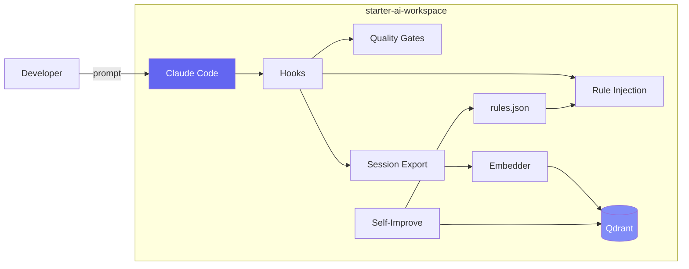
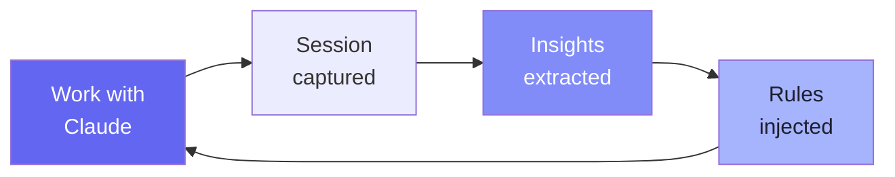

# Session 3: Getting Started with the Workspace

Week 1 · Non-Technical · 60 min

<!--
This is the final session of Week 1's non-technical track. We cover why a workspace matters, give an architecture overview that everyone can follow, and then walk through the full installation and setup so that by the end, every attendee has the workspace running on their machine and is ready for the technical deep dives in Week 2.
-->

---

# Three Problems with Vanilla Claude Code

<div class="grid grid-cols-3 gap-6 pt-8">

<div>

### 1. Amnesia

Every session starts from **zero**. Claude forgets what you discussed yesterday.

> "We solved this exact bug last week... but Claude doesn't remember."

</div>

<div>

### 2. Knowledge Silos

Knowledge lives in **individuals**, not systems. When someone leaves, their context leaves too.

> "Only Maria knows why we chose that architecture."

</div>

<div>

### 3. No Guardrails

No automatic quality checks on AI output. No consistent patterns.

> "Claude used `as any` everywhere and introduced security issues."

</div>

</div>

<!--
These three problems motivate everything in the workspace. Amnesia means repeated work. Knowledge silos mean fragile teams. No guardrails mean inconsistent, sometimes dangerous output. The workspace addresses all three. Even if you're not a developer, these problems affect you—repeated decisions, lost context, inconsistent quality.
-->

---

# The Solution: starter-ai-workspace

An **opinionated framework** that wraps Claude Code with:

<div class="grid grid-cols-2 gap-8 pt-4">
<div>

### For everyone
- **Session memory** — Claude remembers past work
- **Institutional knowledge** — searchable session history
- **Quality guardrails** — automatic code quality checks
- **Self-improvement** — the system learns from mistakes

</div>
<div>

### For developers
- **Skills** — domain expertise loaded on demand
- **Hooks** — lifecycle events for automation
- **Commands** — `/commit`, `/debug`, `/pr-review`
- **MCP servers** — integrate external tools
- **Semantic search** — find past solutions instantly

</div>
</div>

<br>

> Think of it as the **operating system** for Claude Code — it makes the AI smarter, more consistent, and more useful over time.

<!--
The starter-ai-workspace is an open-source project that wraps Claude Code with infrastructure for memory, quality, and self-improvement. It's like going from a standalone text editor to a full IDE. You get all the same capabilities, plus memory, guardrails, and automation. We'll get everyone set up today.
-->

---

# Architecture Overview



<!--
Don't worry about every box here—we'll cover each one in detail in later sessions. The key takeaway: you talk to Claude Code normally. The workspace adds layers around it automatically—quality checks, rule injection, session capture, and a learning loop. You don't need to change how you work; the workspace enhances it behind the scenes.
-->

---

# The Virtuous Cycle



<div class="pt-4 text-center">

**Every session makes the next session better.**

The more you use it, the smarter it gets — for your entire team.

</div>

<!--
This is the key insight. It's not a one-time setup—it's a system that compounds in value over time. Every session teaches the system something. Every mistake becomes a rule that prevents the same mistake in the future. Knowledge from one person benefits everyone on the team.
-->

---

# What Changes for Everyone

<div class="grid grid-cols-2 gap-8 pt-4">
<div>

### Product managers
- Search past sessions for "why did we build X this way?"
- AI output follows consistent patterns
- Fewer bugs from AI-generated code

### Executives
- Knowledge stays with the company, not individuals
- Quantifiable improvement in AI output quality
- Lower AI cost over time (fewer mistakes = less rework)

</div>
<div>

### Designers
- Skills enforce design system compliance
- Code quality hooks catch accessibility issues
- Session memory tracks design decisions

### QA Engineers
- Consistent test patterns from AI
- Self-improvement system learns from test failures
- Searchable history of bug fixes

</div>
</div>

<!--
Even if you never touch the terminal, the workspace makes your life better. For PMs, you can search past sessions to understand decisions. For executives, knowledge retention is built into the system. For designers, the AI follows your design system. For QA, test patterns are consistent and improve over time.
-->

---

# Vanilla vs. Workspace-Enhanced

<div class="grid grid-cols-2 gap-4 pt-4">
<div>

#### Vanilla Claude Code

```
$ claude
> Fix the login timeout bug
Claude: Let me look at the code...
[reads files, finds bug, fixes it]
Done! (forgets everything tomorrow)
```

</div>
<div>

#### Workspace-Enhanced

```
$ claude
> Fix the login timeout bug
[Hook] Skill: swe-frontend
[Hook] 3 rules injected
Claude: Found similar bug in session
  #abc123 from 2 weeks ago...
[applies known fix pattern]
Done! (saved, searchable, reinforced)
```

</div>
</div>

> The workspace doesn't change how you work — it makes the AI **remember, learn, and follow your standards** automatically.

<!--
The difference is dramatic. In vanilla Claude Code, every session starts from scratch. In the workspace, Claude gets contextual rules, skill suggestions, and can search past sessions. The fix is informed by past experience. And this session will be embedded and searchable for next time.
-->

---
layout: section
---

# Let's Get Set Up

Installation walkthrough — follow along on your laptops

<!--
Now for the hands-on part. We're going to get everyone set up with the workspace. Most of this is straightforward: clone, install, and verify. Developers should help neighbors who get stuck. By the end of this section, everyone should have the workspace running.
-->

---

# Prerequisites Check

You installed these in Session 1 — let's verify everything is ready:

```bash
# Quick check — run all four:
node --version          # v18+ required (v22 recommended)
npm --version           # 10+ (comes with Node)
git --version           # Any recent version
claude --version        # Claude Code installed
docker --version        # Optional, for memory features
```

<div class="grid grid-cols-2 gap-8 pt-2">
<div>

### All green? You're ready.

### Missing something?

| Problem | Fix |
|---------|-----|
| `node` not found | Install nvm: see Session 1 slides |
| `claude` not found | `npm install -g @anthropic-ai/claude-code` |
| `docker` not found | Install Docker Desktop (optional) |
| `git` not found | [git-scm.com](https://git-scm.com) |

</div>
<div>

### Need a quick nvm refresher?

```bash
# macOS/Linux
curl -o- https://raw.githubusercontent.com/nvm-sh/nvm/v0.40.1/install.sh | bash
# Reopen terminal, then:
nvm install 22 && nvm use 22
```

```powershell
# Windows (nvm-windows)
# github.com/coreybutler/nvm-windows/releases
nvm install 22
nvm use 22
```

</div>
</div>

<!--
Quick prereq check. Everyone should have installed these after Session 1's homework. If you're missing something, the table has quick fixes. Developers, help your neighbors get sorted—we need everyone ready for the installation walkthrough next.
-->

---

# Step-by-Step Installation

<div class="grid grid-cols-2 gap-8">
<div>

### 1. Clone the workspace

```bash
# Fork first on GitHub, then clone your fork
git clone https://github.com/YOUR-USER/starter-ai-workspace.git
cd starter-ai-workspace
```

### 2. Install dependencies

```bash
npm install
```

### 3. Configure MCP tokens

```bash
# Copy the template
cp .mcp.json.example .mcp.json

# Edit .mcp.json — add your GitHub PAT
# (your tokens stay local, never committed)
```

</div>
<div>

### 4. Start Docker services (optional)

```bash
# Start Qdrant vector database
docker-compose up -d

# Verify it's running
docker-compose ps
# Should show: qdrant ... Up
```

### 5. Embed sessions & verify

```bash
# Downloads embedding model (~130MB first time)
npm run session:embed

# Check everything works
npm run session:stats
```

### 6. Start Claude Code!

```bash
claude
```

</div>
</div>

<!--
Follow along step by step. Step 1: clone your fork. Step 2: npm install takes about 30 seconds. Step 3: the MCP config file has your personal tokens—it's gitignored so it never gets committed. Step 4: Docker is optional but lets you use session memory search. Step 5: embedding downloads a small AI model on first run. Step 6: you're ready!
-->

---

# Verify Your Setup

Run these checks to confirm everything is working:

```bash
# Check Claude Code is installed
claude --version                    # Should show version number

# Check workspace dependencies
npm ls --depth=0                    # Should list packages without errors

# Check Docker services (if using)
docker-compose ps                   # Should show qdrant as "Up"

# Check session system (if Docker is running)
npm run session:stats               # Should show vector store statistics
```

### Troubleshooting

| Problem | Fix |
|---------|-----|
| `npm install` fails | Check Node.js version: `node --version` (needs 18+) |
| `docker-compose` not found | Install Docker Desktop, or skip Docker for now |
| `session:stats` errors | Make sure Qdrant is running: `docker-compose up -d` |
| `.mcp.json` warnings | Copy from `.mcp.json.example` and add your tokens |

> **Stuck?** Raise your hand — or ask a neighbor. No one should leave today without a working setup.

<!--
Let's all run these verification steps together. If you see errors, check the troubleshooting table. The most common issues are: wrong Node.js version, Docker not running, or missing .mcp.json. Developers, please help people around you if they're stuck.
-->

---

# What's In the Box

```
ai-workspace/
├── .claude/
│   ├── hooks/scripts/          # Lifecycle hooks (quality, export, rules)
│   ├── skills/                 # Domain expertise (auto-loaded)
│   ├── commands/               # Slash commands (/commit, /debug)
│   └── logs/sessions/          # Exported session JSON files
├── scripts/
│   ├── session-embedder/       # Embedding pipeline + search
│   └── self-improvement/       # ExpeL + Reflexion + rules
├── extensions/
│   └── workspace-mcp/          # Custom MCP server
├── agent/
│   ├── _projects/              # Linked project directories
│   └── _tasks/                 # Task tracking (markdown)
├── CLAUDE.md                   # Main workspace instructions
└── docker-compose.yml          # Qdrant vector database
```

> We'll explore each of these in detail over the next sessions. For now, just know they're there.

<!--
This is the folder structure. Don't worry about memorizing it. The key takeaway: everything is organized, tracked in git, and travels with the workspace. We'll dive into hooks, skills, commands, and memory in Sessions 4-6.
-->

---

# What Happens Behind the Scenes

When you use the workspace, here's what fires automatically:

<div class="grid grid-cols-2 gap-8">
<div>

```
$ claude
[Hook] UserPromptSubmit:
  ✓ Skill suggested: swe-frontend
  ✓ 3 rules injected from rules.json

> Fix the auth timeout in session.ts

Claude: Found similar issue in session
  #abc123 from 2 weeks ago.
  Applying known fix pattern...

[Hook] PostToolUse (Edit):
  ✓ No `as any` detected
  ✓ No hardcoded secrets

[Bash] npm test -- auth
  ✓ 12 tests passed
```

</div>
<div>

### What fired automatically

| Layer | What happened |
|-------|--------------|
| **Skill** | Loaded relevant domain patterns |
| **Rules** | Injected lessons from past sessions |
| **Memory** | Found similar bug fix from history |
| **Hook** | Blocked bad patterns in real-time |
| **Tests** | Verified the fix passes |

### After the session

- Session exported and embedded
- Self-improvement scores the session
- Rules reinforced if they helped

</div>
</div>

<!--
This is the full picture of a workspace-enhanced session. Every layer is automatic—the developer just types their prompt normally. We'll cover each layer in depth: Session 4 covers skills, hooks, and commands. Session 5 covers memory. Session 6 covers self-improvement.
-->

---
layout: center
---

# Live Demo

### The Workspace Experience

<div class="grid grid-cols-5 gap-6">
<div class="col-span-2 text-gray-400 pt-2">

1. Start Claude Code — observe hook output
2. Search memory: `npm run tiered:search "auth timeout"`
3. Show a skill auto-activating on a `.tsx` file
4. Show `npm run self:stats` — improvement metrics
5. Compare: **with** vs **without** the workspace

</div>
<div class="col-span-3 flex items-center justify-center">


</div>
</div>

<!--
[LIVE DEMO] Walk through the workspace experience. Start Claude Code and show the hooks firing. Search session memory. Show self:stats. The goal is to make the difference between vanilla Claude Code and workspace-enhanced tangible for everyone—especially non-developers.
-->

---

# Homework: Explore & Verify

<div class="grid grid-cols-2 gap-8">
<div>

### For everyone (15 min)
1. **Verify your setup** — run all the checks from the verification slide
2. Read through the `CLAUDE.md` file
3. Start `claude` and ask it to explain a file
4. Share your experience in **#ai-workspace**

### For developers
- Browse `.claude/skills/` — read one SKILL.md
- Browse `.claude/hooks/scripts/` — read one hook
- Try `npm run tiered:search "any topic"`

</div>
<div>

### For non-developers
- Read the `README.md` end to end
- Note 3 things that would help your role
- Don't worry about understanding every file — focus on the big picture

### Discussion question
> *"If Claude Code could remember everything your team has ever done, what would you search for first?"*

Write your answer down — we'll use it in Session 5 when we cover session memory.

</div>
</div>

<!--
Everyone should leave today with a working workspace. The homework is about exploring and getting comfortable. Developers go deeper into skills and hooks. Non-developers focus on the README and the big picture. The discussion question plants a seed for the memory session.
-->

---
layout: section
---

# Q&A

Session 3 of 11 complete · Week 1 done!

**Next week**: Skills, Hooks & Commands (Session 4) + Memory Strategies (Session 5)

<!--
That wraps up Week 1—three sessions covering what AI is, how Claude Code works, and getting everyone set up with the workspace. Week 2 goes deeper: Session 4 covers skills, hooks, and commands. Session 5 covers memory strategies. Questions before we wrap?
-->
