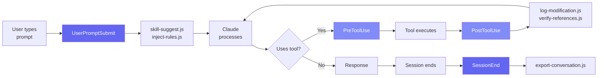
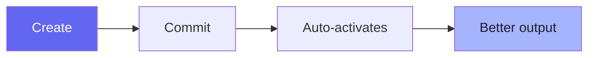

# Session 4: Skills, Hooks & Commands

Week 2 · Technical · 60 min (Session 4 of 11)

<!--
This session dives deep into the three pillars of workspace customization: Skills (domain expertise), Hooks (lifecycle automation), and Commands (developer shortcuts). We'll look at real code from the repo and build understanding of how these systems work together.
-->

---
layout: section
---

# Skills System

Domain expertise, loaded on demand

<!--
Skills are the workspace's way of giving Claude specialized knowledge. Instead of putting everything in CLAUDE.md, skills are organized by domain and auto-activated when relevant.
-->

---

# What Are Skills?

<div class="grid grid-cols-2 gap-8">
<div>

### A skill is a `SKILL.md` file that:

- Lives in `.claude/skills/<name>/`
- Contains domain-specific expertise
- Auto-activates based on file patterns & keywords
- Provides patterns, conventions, and guidance

### Built-in skills

- `swe-frontend` — React/Next.js/TypeScript
- `swe-csharp` — C#/.NET development
- `godot-standards` — Godot game engine
- `ops-generalist` — DevOps/infrastructure
- `agent-creator` — Creating new agents

</div>
<div>

### Skill metadata (from `swe-frontend`)

```yaml
---
name: swe-frontend
description: Frontend engineering with
  React/Next.js expertise
version: 1.2.0
auto_activation:
  file_patterns:
    - "*.tsx"
    - "*.jsx"
    - "*.css"
    - "**/next.config.*"
    - "**/tailwind.config.*"
  keywords:
    - "react"
    - "next.js"
    - "frontend"
    - "component"
    - "tailwind"
---
```

</div>
</div>

<!--
Skills are markdown files with YAML frontmatter. The auto_activation section tells the workspace when to suggest this skill—when you're working with tsx files or mention "react" in your prompt, the frontend skill gets suggested. Skills travel with the repo, so the whole team gets the same expertise.
-->

---

# The Skill Suggestion Hook

When you type a prompt, `skill-suggest.js` checks for relevant skills:

<<< @/snippets/skill-suggest.js

<!--
This is the actual code from the workspace. When you submit a prompt, this hook scans for keywords. If you mention "react" or "component," it suggests the swe-frontend skill. If you mention "bug" or "error," it suggests systematic-debugging. Simple keyword matching but very effective at routing expertise.
-->

---
layout: section
---

# Hooks System

Lifecycle events for automation

<!--
Hooks are the workspace's nervous system. They fire at key moments in the Claude Code lifecycle and can inject information, enforce rules, or capture data.
-->

---

# The Hook Pipeline



<!--
There are four hook points: UserPromptSubmit (when you type), PreToolUse (before a tool runs), PostToolUse (after a tool runs), and SessionEnd (when the session closes). Each hook can inject text, block actions, or perform side effects. The workspace uses all four.
-->

---

# Hook Configuration

From `.claude/settings.json`:

```json
{ "hooks": {
    "PostToolUse": [{ "matcher": "Write|Edit",
      "hooks": [
        { "command": "node .claude/hooks/scripts/log-file-modification.js" },
        { "command": "node .claude/hooks/scripts/verify-file-references.js" }
      ] }],
    "UserPromptSubmit": [{ "hooks": [
        { "command": "node .claude/hooks/scripts/skill-suggest.js" },
        { "command": "node .claude/hooks/scripts/inject-rules.js" }
      ] }],
    "SessionEnd": [{ "hooks": [
        { "command": "node .claude/hooks/scripts/export-conversation.js" }
      ] }]
} }
```

<!--
This is the actual settings file. Note the matchers—PostToolUse hooks only fire for Write and Edit tools. UserPromptSubmit fires on every prompt. SessionEnd fires once when you close the session. Each hook has a timeout to prevent slowdowns.
-->

---

# Code Quality Hooks

The workspace enforces code quality automatically:

| Hook | Type | Trigger | What It Does |
|------|------|---------|-------------|
| `block-as-any` | **Block** | `as any` casts | Prevents type system escape |
| `block-hardcoded-secrets` | **Block** | API keys in code | Prevents secret commits |
| `warn-any-type` | Warn | `: any`, `<any>` | Suggests specific types |
| `warn-debug-code` | Warn | `console.log` | Reminds to remove debug code |
| `warn-foreach` | Warn | `.forEach()` | Suggests `for...of` |
| `warn-interface-prefix` | Warn | `interface IFoo` | Suggests modern naming |

<br>

> **Blocking** hooks prevent the action. **Warning** hooks show a message but allow it to proceed.

<!--
These hooks run automatically every time Claude writes or edits code. They catch common AI coding mistakes like using `as any` to bypass TypeScript's type system, or accidentally hardcoding API keys. This is your safety net—even if Claude makes a mistake, the hooks catch it.
-->

---
layout: section
---

# Slash Commands

Developer shortcuts for common workflows

<!--
Slash commands are predefined workflows that encode best practices. Instead of telling Claude how to commit or debug, you just type a command.
-->

---

# Key Commands

<div class="grid grid-cols-2 gap-8">
<div>

### `/commit`
Creates conventional commits with proper formatting:
```
feat: add input validation to signup form

- Email format validation
- Password strength requirements
- Required field checks

🤖 Generated with Claude Code

Co-Authored-By: Claude <noreply@anthropic.com>
```

### `/debug`
4-phase root cause analysis:
1. **Observe** — Gather symptoms
2. **Hypothesize** — List possible causes
3. **Test** — Verify each hypothesis
4. **Fix** — Apply the root cause fix

</div>
<div>

### `/pr-review`
Comprehensive pull request review:
- Code quality analysis
- Security vulnerability scan
- Test coverage assessment
- Architecture impact evaluation

### `/session-review`
End-of-session review:
- Summarizes work completed
- Suggests CLAUDE.md improvements
- Identifies patterns to codify

</div>
</div>

<!--
These commands encode your team's best practices into repeatable workflows. Instead of explaining how you want commits formatted every time, just type /commit. Instead of manually reviewing PRs, use /pr-review for a structured analysis. The beauty is that these commands are customizable—you can create your own.
-->

---

# Creating Your Own Skill

<div class="grid grid-cols-2 gap-8">
<div>

### 1. Create the directory

```
.claude/skills/my-api-skill/
└── SKILL.md
```

### 2. Write the SKILL.md

```markdown
---
name: my-api-skill
description: Backend API expertise
auto_activation:
  file_patterns: ["**/routes/*.ts"]
  keywords: ["api", "endpoint", "rest"]
---
# API Development Expert
## Conventions
- All endpoints need auth middleware
- Use Zod for request validation
- Return consistent error shapes
```

The skill auto-activates when relevant.

</div>
<div>

### Best practices

- **Be specific** — focus on one domain
- **Include examples** — show the patterns you want
- **Document conventions** — what's important in your project
- **Add file patterns** — so it activates automatically
- **Keep it concise** — skills consume context tokens

### Skill lifecycle



</div>
</div>

<!--
Creating a skill is as simple as writing a markdown file. Put it in .claude/skills/your-skill-name/SKILL.md and it auto-activates. Skills are committed to git, so the entire team benefits. Start with one skill for your most common domain—maybe your API conventions or your component patterns.
-->

---

# Community Skills & Resources

<div class="grid grid-cols-2 gap-8">
<div>

### UI/UX Pro Max Skill

A production-grade skill for **design intelligence**:

- 67 UI styles (glassmorphism, brutalism, etc.)
- 96 color palettes + 57 font pairings
- 99 UX guidelines + accessibility rules
- 13 tech stacks (React, Vue, SwiftUI, Flutter...)
- Industry-specific reasoning (SaaS, healthcare, e-commerce)

```bash
# Install via CLI
npm install -g uipro-cli
uipro init --ai claude
```

> [github.com/nextlevelbuilder/ui-ux-pro-max-skill](https://github.com/nextlevelbuilder/ui-ux-pro-max-skill)

</div>
<div>

### Awesome Claude Code

The **ecosystem directory** — 550+ curated resources:

| Category | Examples |
|----------|---------|
| Skills | AgentSys, DevOps, Security |
| Hooks | TDD Guard, Britfix, CC Notify |
| Commands | 34 slash commands across 8 categories |
| CLAUDE.md | 22 real-world templates |
| Orchestrators | Claude Squad, Claude Swarm |

> [github.com/hesreallyhim/awesome-claude-code](https://github.com/hesreallyhim/awesome-claude-code)

### Finding what you need

Before building from scratch, check if the community already has it!

</div>
</div>

<!--
The Claude Code ecosystem is growing fast. UI/UX Pro Max is a great example of how sophisticated skills can get—67 UI styles, industry-specific reasoning, accessibility enforcement. Awesome Claude Code is the go-to directory when you need a hook, command, or CLAUDE.md template. Always check the community before building from scratch.
-->

---
layout: section
---

# Plugins & Marketplace

Packaging and sharing workspace extensions

<!--
Plugins are the packaging layer above skills, hooks, and commands. They bundle all these together into installable, shareable units. PPT is already using a custom marketplace for this.
-->

---

# What is a Plugin?

<div class="grid grid-cols-2 gap-8">
<div>

### A plugin bundles:

- **Slash commands** — custom workflows (`/deploy`, `/audit`)
- **Skills** — domain expertise (auto-activated)
- **MCP servers** — tool integrations
- **Hooks** — lifecycle automation
- **Subagents** — specialized agent definitions

### One install, everything included

```bash
# Install from community
claude plugin install @team/api-standards

# Install from internal registry
claude plugin install @ppt/design-system-plugin
```

</div>
<div>

### Plugin structure

```
my-plugin/
├── package.json           # Plugin manifest
├── commands/
│   └── deploy.md          # Slash commands
├── skills/
│   └── my-domain/
│       └── SKILL.md       # Domain skills
├── hooks/
│   └── check-naming.js    # Custom hooks
└── mcp-servers/
    └── config.json        # MCP configs
```

### Why plugins matter

- **Reuse** across projects and teams
- **Version control** — pin to specific versions
- **Composable** — mix community + internal
- **Discoverable** — browse marketplace

</div>
</div>

<!--
Think of plugins as npm packages for Claude Code. Instead of manually copying skills and hooks between projects, you install a plugin once. PPT is already using this pattern with their internal marketplace. The plugin bundles everything Claude needs for a domain into one installable unit.
-->

---

# Creating a Plugin

<div class="grid grid-cols-2 gap-8">
<div>

### 1. Define the manifest

```json
{ "name": "@ppt/api-standards",
  "version": "1.0.0",
  "claude-plugin": {
    "commands": ["commands/"],
    "skills": ["skills/"],
    "hooks": ["hooks/"]
  } }
```

### 2. Add content + Publish

- SKILL.md files, slash commands, hooks

```bash
npm publish --registry https://registry.ppt.dev
```

</div>
<div>

### Plugin marketplace (PPT)

| Plugin | Purpose |
|--------|---------|
| `@ppt/design-system` | Design tokens + components |
| `@ppt/api-standards` | REST API conventions |
| `@ppt/testing` | Test patterns + coverage |
| `@ppt/devops` | Deploy + infra automation |

```bash
claude plugin install @ppt/design-system
claude plugin update
```

> Encode institutional knowledge **once**, deploy **everywhere**.

</div>
</div>

<!--
Creating a plugin is straightforward—it's a directory with a manifest that declares what it includes. PPT's internal marketplace is a great example: team-specific plugins that encode conventions and standards. When a new developer joins, they install the team's plugins and immediately get all the conventions enforced automatically.
-->

---
layout: center
---

# Live Demo

### Hooks Enforcing Code Quality

<div class="grid grid-cols-5 gap-6">
<div class="col-span-2 text-gray-400 pt-2">

1. Start Claude Code with hooks active
2. Ask it to write a function using `any` type
3. Watch `block-as-any` **stop the output mid-write**
4. Claude revises automatically to use `unknown`

</div>
<div class="col-span-3 flex items-center justify-center">


</div>
</div>

<!--
[LIVE DEMO] Show hooks as automated guardrails. Ask Claude to use `any` — watch the hook block it and force a revision to `unknown`. This makes the quality enforcement concrete and memorable. It's not just documentation — the workspace actually stops the mistake.
-->

---

# Homework: Create a Skill or Plugin

<div class="grid grid-cols-2 gap-8">
<div>

### Task (20 min)
1. Create `.claude/skills/my-team-skill/SKILL.md`
2. Add frontmatter with auto-activation triggers
3. Document your team's top 5 conventions
4. Include at least one code example
5. Commit and push to your fork

### Template to start from:
```markdown
---
name: my-api-conventions
auto_activation:
  file_patterns: ["**/routes/*.ts"]
  keywords: ["api", "endpoint"]
---

# API Conventions
- Always use Zod for validation
- Return { data, error } shape
- Paginate list endpoints
```

</div>
<div>

### Mini-workshop (in trios, 15 min)
- Form groups of 3
- Each person demos one hook from the workspace
- Together, design a **custom hook** for your org:
  - What would it check?
  - When would it fire (PreToolUse/PostToolUse)?
  - Would it block or warn?

### Bonus: Plugin planning
- Sketch a plugin for your team that bundles:
  - 1 skill + 1 hook + 1 command
- What would you name it?

### Reflection question
> *"What's the #1 mistake Claude Code makes in your codebase that a hook could prevent?"*

</div>
</div>

<!--
Creating a skill is the most hands-on homework yet. It forces people to articulate their team's conventions, which is valuable even beyond AI. The mini-workshop on custom hooks gets people thinking about quality gates specific to their codebase. The bonus plugin planning plants the seed for team-wide standardization.
-->

---
layout: section
---

# Q&A

Session 4 of 11 complete · **Next**: Memory Strategies (Session 5)

<!--
Questions? Discuss which skills would be most valuable for your team, how hooks could enforce your coding standards, or how plugins could package your team's conventions.
-->
