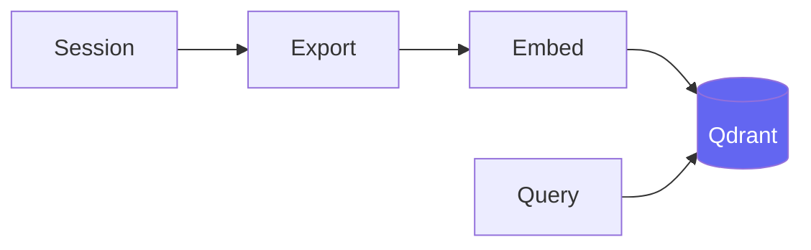
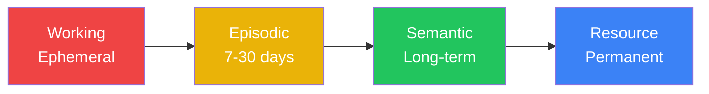
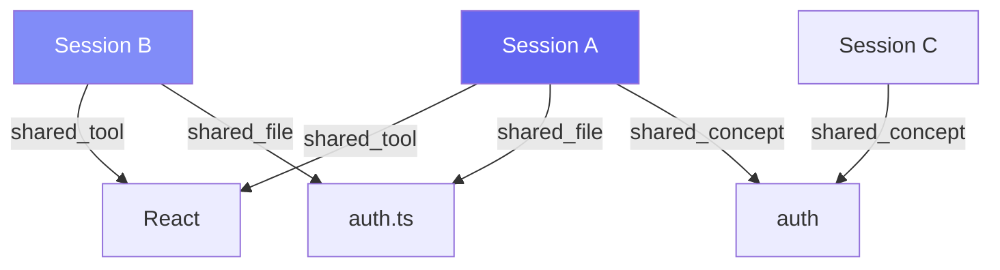

# Session 5: Memory Strategies for AI Agents

Week 2 · Technical · 60 min (Session 5 of 11)

<!--
This session covers the memory problem—Claude forgets between sessions—and the multiple strategies teams use to solve it. We'll cover CLAUDE.md files, commit-based memory, vector databases, and hybrid approaches. The key insight: there's no single "right" answer. Different teams are succeeding with different strategies.
-->

---

# The Memory Problem

<div class="grid grid-cols-2 gap-8">
<div>

### Without memory

```
Monday:
  You: Fix the auth timeout bug
  Claude: [fixes it, learns the codebase]

Tuesday:
  You: Fix the related session bug
  Claude: What's your project structure?
          What auth library do you use?
          Where are the config files?
          (starts from zero)
```

**Every session is groundhog day.**

</div>
<div>

### With any memory strategy

```
Monday:
  You: Fix the auth timeout bug
  Claude: [fixes it, knowledge captured]

Tuesday:
  You: Fix the related session bug
  Claude: Based on project conventions and
          past context, the config is in
          src/auth/config.ts using the
          jose library...
          [continues where you left off]
```

**Sessions build on each other.**

</div>
</div>

<!--
This is the core problem. Without memory, every session is independent. The question isn't whether you need memory—you do. The question is which memory strategy fits your team's workflow and infrastructure appetite.
-->

---

# Four Memory Strategies

<div class="grid grid-cols-2 gap-4 pt-2">
<div>

### 1. Markdown Files (CLAUDE.md)
**Effort: Low · Infrastructure: None**

Hierarchical markdown files loaded every session.

### 2. Commit-Based Memory
**Effort: Low · Infrastructure: None**

Verbose commits + skills that read commit history.

</div>
<div>

### 3. Vector Database (Qdrant, Chroma)
**Effort: Medium · Infrastructure: Docker**

Semantic embeddings of past sessions.

### 4. Hybrid Approach
**Effort: Medium · Infrastructure: Varies**

Markdown for conventions + vector DB for session search.

</div>
</div>


<!--
Four strategies, from simplest to most powerful. The right choice depends on your team size, infrastructure tolerance, and how much past context matters for your work. Let's look at each one.
-->

---

# Strategy 1: Markdown Files (CLAUDE.md)

<div class="grid grid-cols-2 gap-8">
<div>

### How it works

- Hierarchical `.md` files loaded every session
- Git-tracked: whole team gets same knowledge
- **No infrastructure required**

```
~/.claude/CLAUDE.md         # Personal prefs
./CLAUDE.md                 # Project conventions
./src/api/CLAUDE.md         # API-specific rules
```

### Ryan's approach: `improve-skill`

A skill that **auto-updates** MD files based on lessons learned each session.

</div>
<div>

### Pros
- Zero setup — just a file
- Human-readable, git-tracked, diffable
- Under 200 lines: 92%+ rule application

### Cons
- No semantic retrieval — everything loads
- Doesn't scale past ~400 lines (drops to 71%)
- Manual curation required

### Best for
- **Every team** (baseline — always do this)
- Small to medium projects
- When you can articulate your conventions clearly

</div>
</div>

<!--
Markdown files are the dominant pattern and should be your baseline regardless of what else you add. Ryan has an interesting twist: his improve-skill automatically updates the MD files based on lessons learned. This keeps the memory evolving without manual effort. The key limit: everything loads every time, so keep it concise.
-->

---

# Strategy 2: Commit-Based Memory

<div class="grid grid-cols-2 gap-8">
<div>

### John's approach: verbose commits

```bash
a1b2c3d fix(auth): resolve timeout by
         increasing session TTL

         Root cause: config.ts had hardcoded
         300000ms instead of env.SESSION_TTL.
         Files: src/auth/config.ts
         Tests: 3 tests for TTL validation

d4e5f6g feat(api): add rate limiting
         Using express-rate-limit.
         Config: 100 req/min per IP.
```

A skill reads latest commits at session start.

</div>
<div>

### Pros
- Zero infrastructure — just git
- Naturally versioned and revertable
- Team-shared automatically (after push)

### Cons
- Only captures committed changes
- Quality depends on commit discipline
- No semantic search — chronological only

### Best for
- Teams with strong commit discipline
- When you don't want additional infrastructure

</div>
</div>

<!--
John's approach is elegant: make commits verbose enough that they serve as a memory record. A skill at session start reads the last N commits so Claude knows what happened recently. The discipline cost is writing good commits—but that's a best practice anyway. Combines well with CLAUDE.md for conventions.
-->

---

# Strategy 3: Vector Database (Qdrant/Chroma)

<div class="grid grid-cols-2 gap-8">
<div>

### How it works



- **bge-small-en-v1.5** model (local, 384-dim)
- **Qdrant** in Docker at localhost:6333
- Three search modes: semantic, hybrid, tiered

</div>
<div>

### Pros
- **Semantic retrieval** — finds meaning, not keywords
- Scales to thousands of sessions
- Enables "what did we do about X?" queries

### Cons
- Requires Docker + Qdrant
- Embedding pipeline adds complexity
- Extra setup per team member

### Best for
- Teams with many sessions to search
- When institutional knowledge matters


</div>
</div>

<!--
Vector databases give you semantic search—find past solutions by meaning, not just keywords. The workspace implements this with Qdrant. It's the most powerful approach but requires Docker and more setup. The team should decide collectively whether this infrastructure investment is worth it for their workflow.
-->

---

# Strategy 4: Hybrid Approach

<div class="grid grid-cols-2 gap-8">
<div>

### The emerging best practice

Combine **markdown** (source of truth) + **vector DB** (deep search):

```
CLAUDE.md (always loaded)
  → Conventions, standards, commands

Vector DB (searched on demand)
  → Past sessions, solutions, decisions
```

### Comparison

| Aspect | MD | Commits | Vector | Hybrid |
|--------|-----|---------|--------|--------|
| Setup | None | None | Medium | Medium |
| Semantic search | No | No | Yes | Yes |
| Human readable | Yes | Partial | No | Yes |
| Scales to 1000s | No | Partial | Yes | Yes |

</div>
<div>

### Our recommendation

1. **Start with CLAUDE.md** — always, everyone
2. **Add verbose commits** — free, compounds
3. **Add vector DB** when 50+ sessions worth searching
4. **Hybrid** when team reaches 5+ members

### Real-world pattern

Tools like **memsearch** (Zilliz) auto-index markdown into a vector store. Your `.md` files become both human-readable docs and searchable vectors.

</div>
</div>

<!--
The hybrid approach is where most mature teams end up. CLAUDE.md handles conventions and standards—things that should always be loaded. The vector DB handles episodic memory—things you search for when you need them. Start simple and add layers as your needs grow. Don't over-engineer the memory system before you have sessions worth remembering.
-->

---

# The Workspace's Memory Architecture

For teams using the vector DB — a 4-tier system (MemGPT-inspired):



### Three search modes

| Mode | Command | Best for |
|------|---------|----------|
| **Semantic** | `npm run session:search "query"` | Concept searches |
| **Hybrid** | `npm run hybrid:search "query"` | Specific terms |
| **Tiered** | `npm run tiered:search "query"` | Daily workflow (default) |

<!--
The workspace implements all four tiers if you're using Qdrant. Working memory is your current session. Episodic is recent sessions with decay. Semantic is distilled knowledge. Resource is permanent patterns. Three search modes for different needs—default to tiered for daily work.
-->

---

# Under the Hood: Memory Types

<div class="grid grid-cols-2 gap-6">
<div>

### Tiered entry structure

<<< @/snippets/tiered-memory.ts

</div>
<div>

### Hybrid search result

<<< @/snippets/hybrid-search.ts

</div>
</div>

<!--
These are the actual TypeScript types powering the memory system. TieredEntry has recency_score and importance_score so the search can weight results by freshness. HybridSearchResult combines three score signals—semantic, entity, and recency—into a single hybridScore. This is how "tiered search" weights recent sessions higher without dropping older relevant results entirely.
-->

---

# Knowledge Graph & Entity Linking

<div class="grid grid-cols-2 gap-8">
<div>



> Searching "auth" also finds related React sessions that reference auth.ts.

</div>
<div>

### How sessions connect

| Relationship | Meaning |
|------|---------|
| `shared_tool` | Same framework/library |
| `shared_concept` | Same domain/concept |
| `shared_file` | Same files referenced |
| `temporal` | Close in time |

### Entity extraction (automatic)

- **Tools**: React, Express, Jest
- **Concepts**: auth, caching, pagination
- **Files**: specific paths referenced
- **Decisions**: architectural choices

</div>
</div>

<!--
The knowledge graph connects sessions through shared entities. If two sessions both work with React and auth.ts, they're linked. This enables cross-session discovery—searching for auth might surface related React sessions you'd forgotten about. This layer only activates with the vector DB strategy.
-->

---
layout: center
---

# Live Demo

### Memory Strategies in Action

<div class="grid grid-cols-5 gap-6">
<div class="col-span-2">

```bash
# 1. CLAUDE.md impact
claude  # conventions followed immediately

# 2. Commit-based memory
git log --oneline -5  # verbose commits

# 3. Vector DB search
npm run tiered:search "auth timeout fix"
npm run hybrid:search "database migration"
npm run session:stats
```

</div>
<div class="col-span-3 flex items-center justify-center">


</div>
</div>

<!--
[LIVE DEMO] First show how CLAUDE.md immediately shapes Claude's behavior. Then show verbose commit history as a form of memory. If Qdrant is running, demo the three search modes. Emphasize that everyone should start with CLAUDE.md regardless of other strategies.
-->

---

# Homework: Choose and Implement Your Strategy

<div class="grid grid-cols-2 gap-8">
<div>

### For everyone (15 min)
1. **Review and improve** your CLAUDE.md
   - Is it under 200 lines?
   - Does it include key decisions, not just conventions?
2. Make your next 3 commits **verbose**:
   - Include root cause, files changed, decisions
3. Share your updated CLAUDE.md in **#ai-workspace**

### For teams using Qdrant (optional, 20 min)
1. Ensure Qdrant is running: `docker-compose up -d`
2. Embed sessions: `npm run session:embed`
3. Search: `npm run tiered:search "your topic"`
4. Screenshot results and share

</div>
<div>

### Team discussion (10 min)
Discuss with your team:
- Which memory strategy fits your workflow?
- Do you need semantic search, or are MD files enough?
- Who maintains the CLAUDE.md? How often?
- Should you standardize on one approach?

### Reflection question
> *"After 6 months of captured memory, what queries would be most valuable for onboarding a new team member?"*

</div>
</div>

<!--
This homework is intentionally flexible. Everyone should improve their CLAUDE.md and start writing verbose commits—these are free wins. The vector DB setup is optional and should be a team decision. The discussion questions help teams align on what approach works for them.
-->

---
layout: section
---

# Q&A

Session 5 of 11 complete · Week 2 done! · **Next**: The Self-Improving Agent (Session 6)

<!--
Questions? Key points to reiterate: Start with CLAUDE.md (always). Add verbose commits (free). Vector DB is optional but powerful at scale. Don't over-engineer—let your needs drive the complexity.
-->
