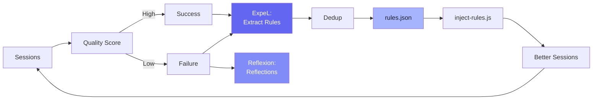
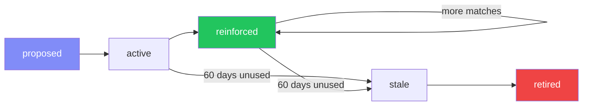

# Session 6: The Self-Improving Agent

Week 3 · Technical · 60 min (Session 6 of 11)

<!--
This session covers the most unique feature of the workspace: the self-improvement loop. Based on AI research papers (ExpeL, Voyager, Reflexion, MemGPT), this system automatically learns from past sessions and improves future output. We'll walk through the pipeline, rule lifecycle, and safety mechanisms.
-->

---

# Research Foundations

The self-improvement system combines ideas from four research papers:

<div class="grid grid-cols-2 gap-6 pt-4">
<div>

### ExpeL (Experience Learning)
- Compare high-quality vs low-quality outputs
- **Extract rules** from the comparison
- Rules are actionable guidelines

### Voyager (Skill Discovery)
- Detect **novel tasks** the agent handles
- Generate reusable **skills** from them
- Skills accumulate over time

</div>
<div>

### Reflexion (Failure Learning)
- Detect **failure patterns** in sessions
- Generate **reflections** (what went wrong)
- Prevent same failures in future

### MemGPT (Tiered Memory)
- **4-tier memory** architecture
- Automatic tier promotion/demotion
- Recency-aware retrieval

</div>
</div>

<!--
The workspace doesn't just remember—it learns. ExpeL teaches it what good output looks like by comparing successes to failures. Reflexion teaches it from mistakes. Voyager discovers new skills. MemGPT manages memory across tiers. Together, they create an agent that gets better the more you use it.
-->

---

# The Self-Improvement Pipeline



<!--
Here's the full pipeline. Sessions are quality-scored. High-quality chunks are compared with low-quality ones to extract rules (ExpeL). Failures generate reflections (Reflexion). New rules are deduplicated against existing ones. Active rules are reinforced when sessions match. Stale rules are pruned after 60 days. The whole thing runs automatically with `npm run session:embed`.
-->

---

# Step 1: Quality Scoring

Sessions are scored to separate successes from failures:

| Signal | Indicates |
|--------|-----------|
| Tool errors followed by 3+ retries | Retry loop (failure) |
| Same file edited 3+ times | Backtracking (failure) |
| Git reset/revert operations | Undoing work (failure) |
| Tests pass after changes | Successful implementation |
| Clean commit at end | Completed task |

<br>

```typescript
// Scoring thresholds (from config.json)
{
  "qualityThresholdSuccess": 5,   // Score >= 5 = success
  "qualityThresholdFailure": 3    // Score <= 3 = failure
}
```

> Sessions scoring 4 are in the "gray zone" — not used for learning.

<!--
Quality scoring is the first step. The system looks at signals in the session: did tests pass? Were there retry loops? Was code reverted? High scores mean things went well. Low scores mean there were problems. Only clear successes and failures are used for learning—the gray zone is ignored.
-->

---

# Step 2: Insight Extraction (ExpeL)

<<< @/snippets/insight-extractor.ts

Algorithm: Query Qdrant for high (>=7) and low (<=3) quality chunks → prompt Claude to extract rules → deduplicate → apply or stage.

<!--
The insight extractor compares successful and failed sessions, then asks Claude to extract actionable rules. Critically, it filters out meta-observations and only keeps rules that start with imperative verbs like "always," "never," "verify." This ensures rules are genuinely actionable guidance, not just descriptions of what happened.
-->

---

# Step 3: Reflection Generation (Reflexion)

<<< @/snippets/reflection-generator.ts

<div class="grid grid-cols-2 gap-8 pt-2">
<div>

### What it detects
- Retry loops (3+ attempts at same fix)
- Backtracking (editing same file repeatedly)
- Git reverts (undoing work)
- Error messages in output

</div>
<div>

### What it generates
- Failure pattern description
- Root cause analysis
- Actionable prevention rule
- Stored as reflection in Qdrant

</div>
</div>

<!--
The reflection generator focuses specifically on failures. It detects four types of failure signals and generates reflections—structured analyses of what went wrong and how to prevent it. These reflections feed back into the rule system, creating guardrails against repeated mistakes.
-->

---

# Rule Lifecycle



### Real rules from `rules.json`:

| Rule | Hits |
|------|------|
| "Always investigate data ordering when refactoring DB calls" | 12 |
| "When optimizing N+1 queries, verify batch produces identical results" | 20 |
| "Read source files before attempting fixes in unfamiliar codebases" | 0 |

<!--
Rules have a full lifecycle. They start as proposals from insight extraction. Once validated, they become active. When a session matches a rule's keywords, the rule is reinforced—proving its value. Rules that go 60 days without reinforcement are marked stale and eventually retired. The most reinforced rules are the most valuable ones.
-->

---

# Runtime Injection

How rules get into Claude's context via `inject-rules.js`:

<<< @/snippets/inject-rules.js

- Fast keyword matching (not embeddings) — runs within 1s hook timeout
- Rules with 2+ keyword matches are injected into context

<!--
This is the runtime injection hook. When you type a prompt, it scores every active rule against your prompt's keywords. Rules with 2+ keyword matches are injected into Claude's context. It's fast (keyword matching, not embeddings) and runs within the 1-second hook timeout. Claude sees these rules as part of its instructions and follows them.
-->

---

# Configuration

```json
// scripts/self-improvement/config.json
{ "approvalMode": "autonomous",
  "maxActiveRules": 500,
  "stalenessThresholdDays": 60,
  "qualityThresholdSuccess": 5,
  "qualityThresholdFailure": 3,
  "deduplicationSimilarity": 0.85 }
```

| Setting | What it controls |
|---------|-----------------|
| `approvalMode` | `autonomous` or `supervised` (review first) |
| `stalenessThresholdDays` | When unused rules get pruned (60d default) |
| `deduplicationSimilarity` | Near-duplicate threshold (0.85) |
| `maxActiveRules` | Cap on total rules (prevents bloat) |

<!--
The config file controls every aspect of the self-improvement system. Approval mode determines whether rules are auto-applied or need review. Staleness threshold prevents rule bloat. Deduplication similarity prevents near-duplicate rules. All values are tunable based on your team's needs.
-->

---

# Safety Mechanisms

<div class="grid grid-cols-2 gap-8 pt-4">
<div>

### Every change is reversible

- All self-improvement changes are **atomic git commits**
- Commit prefix: `chore(self-improve): ...`
- Revert any change: `git revert <hash>`

### Boundaries

- Cannot edit its own hooks or settings
- Cannot modify security configuration
- Cannot push to remote
- Rules stored locally in `rules.json`
- Maximum 500 active rules

</div>
<div>

### Monitoring commands

```bash
# View all rules and their status
npm run self:review

# Show statistics
npm run self:stats

# Generate visual dashboard
npm run self:dashboard

# Manual maintenance
npm run self:maintenance

# Review pending proposals
/review-improvements
```

### The golden rule

> If a self-improvement change causes problems, `git revert` it. The system is designed to be safe by default.

</div>
</div>

<!--
Safety is paramount. Every self-improvement change is a git commit that can be reverted. The system cannot modify its own configuration or security settings. There's a hard cap of 500 rules. And you can review everything with npm commands or slash commands. The system is designed to be transparent and reversible.
-->

---
layout: center
---

# Live Demo

### The Self-Improvement System in Action

<div class="grid grid-cols-5 gap-6">
<div class="col-span-2 pt-2">

1. View current rules: `npm run self:review`
2. Check statistics: `npm run self:stats`
3. Show a rule being injected (trigger with a matching prompt)
4. Dashboard walkthrough: `npm run self:dashboard`

</div>
<div class="col-span-3 flex items-center justify-center">


</div>
</div>

<!--
[LIVE DEMO] Run self:review to show the current rules. Run self:stats to show counts and reinforcement data. Then start a Claude Code session with a prompt that matches a rule—show the rule injection in real-time. Finally, open the dashboard HTML to show the visual overview.
-->

---

# Homework: Trigger the Self-Improvement Loop

<div class="grid grid-cols-2 gap-8">
<div>

### Task (20 min)
1. Run insight extraction on your sessions:
   ```bash
   npm run self:extract-insights
   ```
2. Review what was generated:
   ```bash
   npm run self:review
   ```
3. Check the stats:
   ```bash
   npm run self:stats
   ```
4. Start Claude Code and trigger a rule injection by typing a prompt that matches a rule's keywords

</div>
<div>

### Mini-workshop (in pairs, 10 min)
- Look at `scripts/self-improvement/rules.json`
- Find the rule with the highest `reinforcementCount`
- Discuss: why is this rule reinforced so often?
- Write one rule manually that you think would help your team

### Challenge (optional)
- Run the full pipeline: `npm run session:embed`
- Open the dashboard: `npm run self:dashboard`
- Share a screenshot of your dashboard

</div>
</div>

<!--
This homework makes the self-improvement system tangible. By running insight extraction and reviewing the results, people see how the system learns. Writing a manual rule forces them to think about what actionable guidance looks like.
-->

---
layout: section
---

# Q&A

Session 6 of 11 complete · **Next**: Agent Orchestration, MCP & CLI (Session 7)

<!--
Questions? "What if a rule is wrong?" (Revert the git commit), "Can we add rules manually?" (Yes, edit rules.json), "How does it avoid bad patterns?" (Quality scoring filters).
-->
