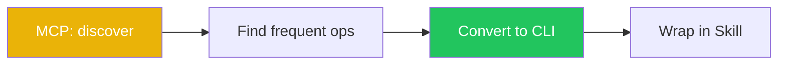
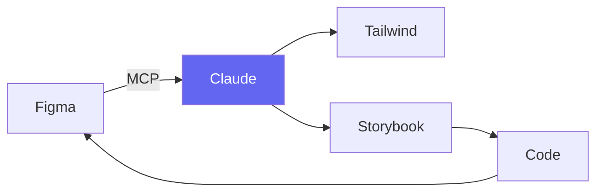
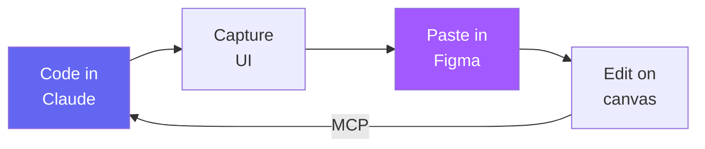
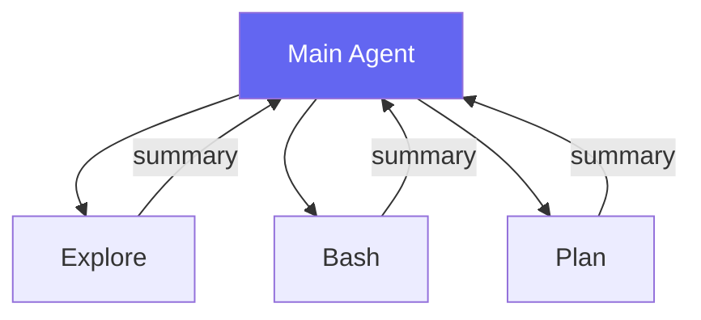
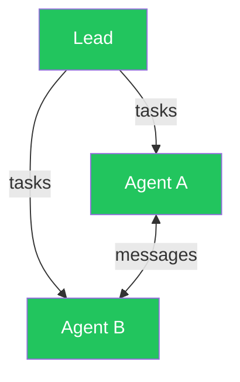
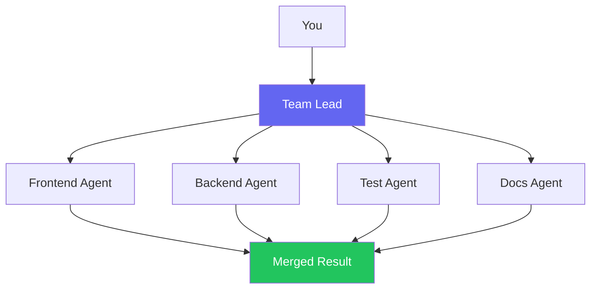
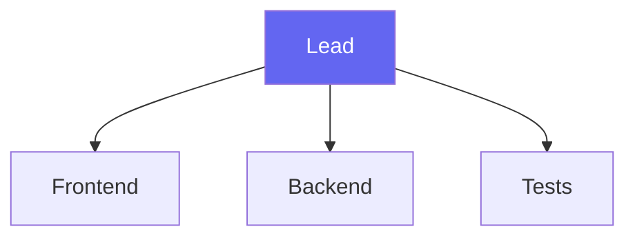
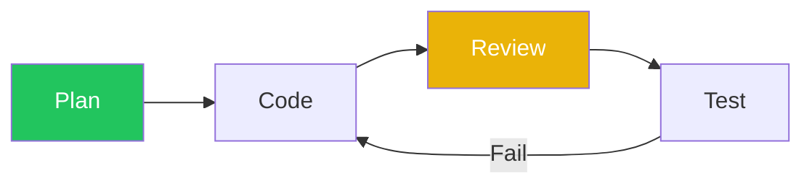
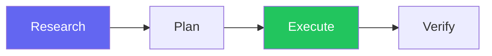

# Session 7: Agent Orchestration, MCP & CLI Tools

Week 3 · Technical · 60 min (Session 7 of 11)

<!--
This session covers how Claude Code connects to external services, the critical MCP vs CLI trade-off, how to orchestrate multiple agents, and best practices from the broader AI engineering community. This is the most technical session—it's about making Claude Code work as part of a larger system.
-->

---
layout: section
---

# Connecting to the World

MCP, CLI Tools, and when to use each

<!--
Claude Code can connect to external services in two fundamentally different ways: MCP servers and CLI tools. Understanding the trade-offs is critical for keeping context efficient and costs down.
-->

---

# MCP vs CLI Tools: The Big Trade-Off

<div class="grid grid-cols-2 gap-8">
<div>

### MCP (Model Context Protocol)

- Structured tool discovery with schemas
- Rich type-safe inputs/outputs
- Enterprise access control (RBAC, OAuth)
- **Heavy context cost** (~55K tokens for GitHub schema)

```
Claude → MCP Client → GitHub MCP (93 tools, ~55K tokens)
                     → Figma MCP (20+ tools)
                     → Workspace MCP (3 tools)
```

</div>
<div>

### CLI Tools

- LLMs already know CLI from training data
- Unix composability (pipes, filters)
- **Minimal context cost** (~200 tokens per call)
- Zero schema overhead, transparent

```
Claude → Bash → gh pr list     (~200 tokens)
              → git log        (~100 tokens)
              → aws s3 ls      (~150 tokens)
```

</div>
</div>

<!--
This is one of the most actively debated topics in AI tooling. MCP servers load their entire schema into the context window—the GitHub MCP alone costs ~55K tokens before any work is done. That's roughly a quarter of the context window consumed by tool definitions. CLI tools cost almost nothing because LLMs were trained on CLI documentation.
-->

---

# The Numbers Don't Lie

<div class="grid grid-cols-3 gap-6 pt-4">

<div class="stat-card">
  <div class="number">~55K</div>
  <div class="label">Tokens: GitHub MCP schema</div>
</div>

<div class="stat-card">
  <div class="number">~200</div>
  <div class="label">Tokens: equivalent CLI call</div>
</div>

<div class="stat-card">
  <div class="number">275x</div>
  <div class="label">Context efficiency gap</div>
</div>

</div>

<div class="grid grid-cols-2 gap-8 pt-4">
<div>

### MCP: when it's worth the cost

- Tool **discovery** in large orgs
- **Enterprise** access control (RBAC, OAuth)
- No CLI equivalent (CRMs, ERPs, Figma)
- **Structured responses** needed

</div>
<div>

### CLI: when it wins

- GitHub (`gh`), Git, Cloud CLIs (`aws`, `az`)
- Package managers (`npm`, `pip`)
- Docker/Kubernetes
- **Any tool with a well-known CLI**

</div>
</div>

<!--
275x context efficiency difference is massive. That's the difference between using 25% of your context for tool schemas vs using 0.1%. For most development workflows, CLI tools cover 90% of what you need. MCP is the right choice when you need structured discovery across large organizations or when integrating with services that have no CLI.
-->

---

# The MCP-to-CLI Conversion Workflow

Ronny's approach: start with MCP, then optimize to CLI/skill



<div class="grid grid-cols-2 gap-8">
<div>

### Example: GitHub workflow

**Before** (MCP — 55K tokens):
```
mcp__github__list_issues
mcp__github__create_pull_request
```

**After** (CLI — ~200 tokens):
```bash
gh issue list --state open --label bug
gh pr create --title "Fix" --body "..."
```

</div>
<div>

### Decision framework

| Factor | MCP | CLI |
|--------|-----|-----|
| Context budget tight | | x |
| CLI exists | | x |
| Need discovery | x | |
| Enterprise auth | x | |
| No CLI available | x | |


</div>
</div>

<!--
Ronny's workflow is practical: use MCP to discover what's available and how the API works, then convert the frequent operations to CLI commands wrapped in skills. This gives you the best of both worlds—MCP for exploration, CLI for production use. Ryan's CLI project follows this pattern.
-->

---
layout: section
---

# MCP Servers in the Workspace

When MCP is the right choice

<!--
Despite the context cost, MCP is the right choice for certain integrations. Let's look at the MCP servers the workspace uses and the rich design tool ecosystem.
-->

---

# Workspace MCP Servers

| Server | Purpose | Context cost |
|--------|---------|--------------|
| **GitHub MCP** | Issues, PRs, Actions, search | High (~55K) |
| **Chrome DevTools** | Browser automation, screenshots | Medium |
| **Workspace MCP** | Session memory (3 tools) | Low |

<div class="grid grid-cols-2 gap-8 pt-2">
<div>

### GitHub MCP vs `gh` CLI

| Operation | Prefer |
|-----------|--------|
| List issues/PRs | `gh` CLI |
| Create PR | `gh` CLI |
| Complex search | MCP |
| Projects/boards | MCP (no CLI) |

</div>
<div>

### Workspace MCP (custom, 3 tools)

- `session-search` — hybrid memory search
- `knowledge-query` — session knowledge graph
- `role-recommend` — suggest agent role

> Deliberately lightweight. Wraps `npm run` scripts so Claude can search memory within a conversation.

</div>
</div>

<!--
The workspace's own MCP server is deliberately lightweight—just 3 tools. It wraps the npm search scripts so Claude can search session memory directly within a conversation. For GitHub, the recommendation is to use the gh CLI for common operations and MCP only when you need features the CLI doesn't have, like Projects or complex search.
-->

---

# MCP for Designers

<div class="grid grid-cols-2 gap-6">
<div>

### Official Figma MCP Server

- Layer structure, auto-layout, variants, tokens
- Code Connect integration
- `claude mcp add --transport http figma https://mcp.figma.com/mcp`

### Claude Code to Figma (Feb 2026)

- Code → editable Figma frames (round-trip)

</div>
<div>

### Design tool ecosystem

| Server | Best For |
|--------|----------|
| **Figma Console MCP** | 56+ tools, token export |
| **Storybook MCP** | Component props, validation |
| **Design Systems MCP** | WCAG 2.2/ARIA compliance |
| **html.to.design** | Web → Figma layers |



</div>
</div>

<!--
MCP truly shines for design tools—there's no CLI equivalent for reading Figma designs. The ecosystem has grown rapidly. Figma's official MCP, Storybook integration, and the bidirectional Code-to-Figma bridge make it possible for design and code to stay in sync. We'll cover designer workflows in depth in Session 8.
-->

---

# Code to Canvas: Claude Code → Figma

<div class="grid grid-cols-2 gap-8">
<div>

### The round-trip workflow



Build UI with Claude Code → capture live screens → paste into Figma as **editable frames** → refine on canvas → push updates back to code.

### Setup (3 steps)

1. Enable **Dev Mode MCP Server** in Figma desktop
2. Connect: `claude mcp add --transport sse figma-dev-mode-mcp-server http://127.0.0.1:3845/sse`
3. Start working — reference Figma links in prompts

</div>
<div>

### What you get

- Live UI → **editable Figma layers** (not screenshots)
- Claude reads components, variables, styles
- Multi-screen flows preserved in sequence
- Side-by-side comparison of variants

### Requirements

| Requirement | Details |
|------------|---------|
| Figma | Desktop app (not browser) |
| Seat | Dev or Full seat |
| Claude Code | Installed via npm |

### Limitations

- Desktop-only (no browser Figma)
- Token cost scales with file complexity
- Multi-screen flows need individual capture

> [figma.com/blog/introducing-claude-code-to-figma](https://www.figma.com/blog/introducing-claude-code-to-figma/)

</div>
</div>

<!--
This is one of the most exciting integrations. Build a complete UI with Claude Code, capture the live browser state, and paste it into Figma as real editable frames—not flat screenshots. Then iterate on the canvas, refine the design, and push updates back to code via MCP. It's a true bidirectional bridge between code and design. Announced February 2026 by Figma.
-->

---
layout: section
---

# Multi-Agent Architecture

1 context vs N contexts — and when to use each

<!--
Now let's look at how to orchestrate multiple AI agents working together. Two models: sub-agents within a single session, and agent teams with independent sessions.
-->

---

# The Two Models

<div class="grid grid-cols-2 gap-8">
<div>

### Model A: Sub-Agents (1 context)



Workers report **back to caller**. Never talk to each other. Main agent orchestrates.

</div>
<div>

### Model B: Agent Teams (N contexts)



Fully independent instances. Share a **task list**, **message each other**, self-coordinate.

</div>
</div>

<!--
Two fundamentally different approaches. Sub-agents are lightweight workers within a single session. Agent teams are full Claude Code instances that communicate with each other. Think of sub-agents as delegating to assistants, and agent teams as assembling a cross-functional team.
-->

---

# When to Use Each

|  | Sub-Agents | Agent Teams |
|--|-----------|-------------|
| **Communication** | Report back to main | Message each other |
| **Token cost** | Lower (summaries) | Higher (N instances) |
| **Best for** | Focused tasks (90%) | Cross-domain work (10%) |

<div class="grid grid-cols-2 gap-8 pt-2">
<div>

### Sub-Agents when...
- Task is focused and independent
- You only need the result
- Cost efficiency matters

</div>
<div>

### Agent Teams when...
- Workers need to **challenge each other**
- Work spans **frontend + backend + tests**
- Multiple hypotheses tested in parallel

</div>
</div>

> **Rule of thumb**: start with sub-agents. Upgrade to teams when agents need to *talk to each other*.

<!--
Sub-agents for 90% of work. They're faster, cheaper, and simpler. Agent teams for the complex 10%: when you need agents to debate, share findings, or coordinate on shared code.
-->

---

# Swarm Mode: Agent Teams in Practice

<div class="grid grid-cols-2 gap-8">
<div>

### What is Swarm Mode?

Claude Code can spawn a **team of specialist agents** that work in parallel — like a tech lead delegating to a cross-functional team.



### How it works

1. You describe a complex task
2. Lead creates a plan and **spawns specialists**
3. Each agent gets a **fresh context** + **separate Git worktree**
4. Agents coordinate via shared task boards
5. Code merges only when tests pass

</div>
<div>

### Key features

| Feature | Detail |
|---------|--------|
| **Git isolation** | Each agent in its own worktree |
| **Fresh context** | ~40% usage vs 80-90% single agent |
| **Parallel work** | 3-10x throughput on decomposable tasks |
| **Coordination** | Shared task lists + @mentions |

### When to use Swarm Mode

- Large refactors across many files
- Multi-component features (frontend + backend + tests)
- Codebases exceeding single-agent context limits

### When NOT to use it

- Quick fixes or small changes
- Exploratory work with unclear scope
- Tasks where files overlap heavily

### Try it

```
> Build a REST API with authentication,
  rate limiting, and comprehensive tests.
  Please use a team of specialists.
```

</div>
</div>

<!--
Swarm mode turns Claude Code from a single AI coder into a team lead. Each specialist gets its own Git worktree so there are no file conflicts. The lead coordinates, and code only merges when tests pass. This is the "Model B: Agent Teams" approach in practice. Use it for large, decomposable tasks—not for quick fixes.
-->

---
layout: section
---

# AI Orchestration Best Practices

Patterns from the industry (2025-2026)

<!--
Let's zoom out and look at what the broader AI engineering community has learned about orchestrating coding agents. These patterns apply whether you're using Claude Code, Copilot, Cursor, or any combination.
-->

---

# Orchestration Patterns

<div class="grid grid-cols-2 gap-8">
<div>

### Pattern 1: Orchestrator + Specialists



**Pros**: 3-10x throughput on decomposable tasks
**Cons**: Coordination complexity

</div>
<div>

### Pattern 2: Sequential Pipeline



**Pros**: Safer, each stage validates previous
**Cons**: Slower, no parallelism

</div>
</div>

| Scenario | Pattern |
|----------|---------|
| Independent features | Orchestrator + Specialists |
| Safety-critical | Sequential Pipeline |
| Complex refactoring | Agent Teams (N contexts) |
| Quick tasks | Single agent |

<!--
Two dominant patterns in the industry. Orchestrator + Specialists is fastest for decomposable work—like having a tech lead delegate to frontend, backend, and QA. Sequential Pipeline is safer—like code review stages. Choose based on the risk and independence of the work.
-->

---

# Real-World: Get Shit Done (GSD)

<div class="grid grid-cols-2 gap-8">
<div>

### What it is

A **multi-agent orchestration framework** that solves context rot — quality degradation in long sessions.

```bash
npx get-shit-done-cc@latest
```

### The phased pipeline



Each phase gets a **fresh 200K-token context** — no degradation.

</div>
<div>

### 11 specialized agents

| Agent | Role |
|-------|------|
| `codebase-mapper` | Analyze existing code |
| `phase-researcher` | Deep-dive research |
| `planner` + `plan-checker` | Plan with validation |
| `executor` | Task execution |
| `debugger` | Debug issues |
| `verifier` | Acceptance testing |

### 32 slash commands

`/new-project`, `/plan-phase`, `/execute-phase`, `/verify-work`, `/debug`, `/quick`, and more.

> [github.com/gsd-build/get-shit-done](https://github.com/gsd-build/get-shit-done)

</div>
</div>

<!--
GSD is a real-world implementation of the Orchestrator + Specialists pattern. It breaks complex projects into phases, each with a fresh context window to prevent quality degradation. The 11 specialized agents handle everything from research to verification. The key insight: fresh contexts per task beat one long degraded session.
-->

---

# Tips, Pros & Cons of AI Orchestration

<div class="grid grid-cols-2 gap-8">
<div>

### What works well

- **Front-load planning**: 40-50% time on specs before prompting
- **Small targets**: Functions/components > whole-screen prompts
- **Checkpoint-revert**: Commit before experiments
- **Focused sessions**: One task = one session
- **CLAUDE.md everywhere**: Prevents rediscovery

### Emerging tools

| Tool | Purpose |
|------|---------|
| **LangGraph** | Agent workflow orchestration |
| **Google ADK** | Multi-agent patterns |
| **A2A Protocol** | Agent-to-agent comms |

</div>
<div>

### Common pitfalls

- **Over-orchestration**: 5 agents for a 1-agent task
- **Context rot**: Long sessions degrade — start fresh
- **Agent conflicts**: Same file = merge hell
- **MCP bloat**: 5 MCP servers = 200K+ tokens

### The principle

> **Structured simplicity beats clever complexity.** Invest in clear specs, CLAUDE.md, and composable tools — not elaborate orchestration.

Sebastian's note: tools evolve week to week. Build flexible workflows, not rigid pipelines.

</div>
</div>

<!--
The biggest insight from industry research: structured simplicity wins. The top-performing teams aren't building elaborate multi-agent systems—they're writing good specs, maintaining CLAUDE.md, and using the simplest agent pattern that works. Over-orchestration is a real anti-pattern. And as Sebastian noted, the landscape evolves rapidly—build adaptable workflows, not rigid systems.
-->

---

# Context Management Strategies

<div class="grid grid-cols-2 gap-8">
<div>

### Strategies

| Strategy | Effect |
|----------|--------|
| **CLI over MCP** | 275x less context |
| **Sub-agents** | Research in separate windows |
| **`/compact`** | Compress session manually |
| **Focused sessions** | One task = one session |
| **CLAUDE.md** | Skip project rediscovery |

### Auto-compression

When context fills: older messages summarized, tool output truncated, system instructions preserved. **PreCompact hook** exports before compression.

</div>
<div>

### The OODA Loop

| Phase | Action |
|-------|--------|
| **Observe** | Read the request carefully |
| **Orient** | Search session memory first |
| **Decide** | Choose approach based on context |
| **Act** | Execute in small, verified steps |

> Context window is ~200K tokens. MCP schemas consume significant space. Long sessions degrade quality. Manage actively.

</div>
</div>

<!--
Context management is one of the most important practical skills. The biggest lever is preferring CLI over MCP—275x efficiency. Sub-agents keep research data out of your main context. /compact helps when sessions get long. And the OODA loop ensures you search memory before wasting tokens rediscovering things.
-->

---
layout: center
---

# Live Demo

### MCP vs CLI — Context Cost in Real Time

<div class="grid grid-cols-5 gap-6">
<div class="col-span-2 text-gray-400 pt-2">

1. Run `gh issue list` via CLI — note token cost
2. Run the equivalent via GitHub MCP — compare cost
3. Demo sub-agents parallelizing research
4. Show agent team coordination (if available)

```bash
# CLI: ~100 tokens
gh issue list --limit 5
# MCP: ~55,000 tokens — 275× more
```

</div>
<div class="col-span-3 flex items-center justify-center">


</div>
</div>

<!--
[LIVE DEMO] First, show the token cost difference between an MCP call and the equivalent CLI command. Then show the conversion workflow: use MCP to discover capabilities, convert to CLI. Finally, demo sub-agents investigating multiple issues in parallel. If time permits, show agent teams.
-->

---

# Homework: Build Your Integration Strategy

<div class="grid grid-cols-2 gap-8">
<div>

### Task (20 min)
1. List your current MCP servers:
   ```bash
   cat .mcp.json
   ```
2. Identify which could be replaced with CLI:
   - GitHub operations → `gh` CLI
   - Docker operations → `docker` CLI
3. Try a GitHub operation both ways:
   ```bash
   # CLI way
   gh issue list --state open

   # MCP way (in Claude Code)
   > List open issues using the GitHub MCP
   ```
4. Compare: which was faster? Cheaper?

</div>
<div>

### Mini-workshop (in pairs, 15 min)
- **Scenario**: Bug report + failing tests + design review
- **Plan**: Which operations use MCP? Which use CLI?
- **Sketch** the agent strategy (sub-agents or teams?)

### Challenge (optional)
- Convert one MCP operation to a CLI-based skill
- Configure a new MCP server (Figma, Storybook)
- Measure token costs before/after

### Reflection question
> *"What repetitive multi-step workflow could be automated with sub-agents or CLI tools?"*

</div>
</div>

<!--
This homework makes the MCP vs CLI trade-off tangible. Trying the same operation both ways shows the real difference in speed and cost. The workshop scenario forces people to think critically about when to use each approach.
-->

---
layout: section
---

# Q&A

Session 7 of 11 complete · Week 3 done! · **Next**: Designer & QA Workflows (Session 8)

<!--
Questions? This was the most technical session. Common questions: "Should we remove all MCP servers?" (No—keep them for things with no CLI), "How many sub-agents at once?" (2-5 typically), "What about cost?" (Monitor with usage stats).
-->
