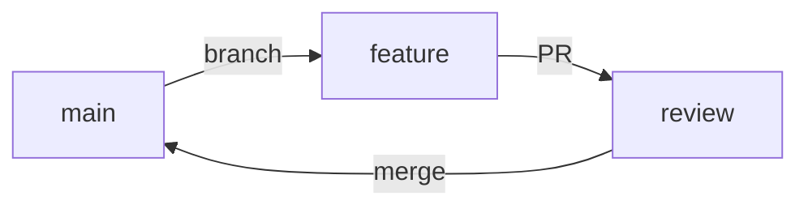
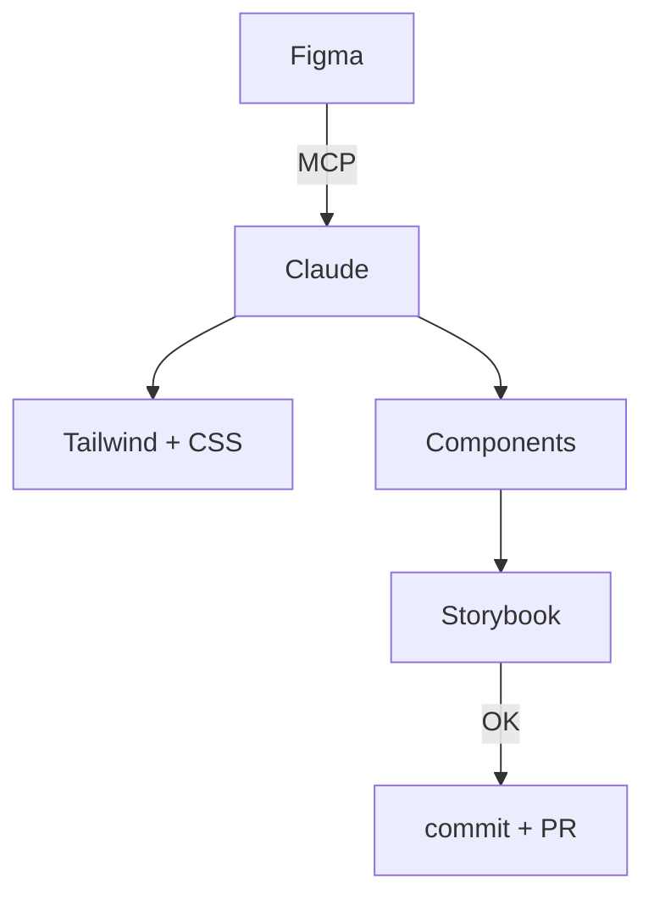
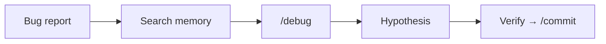

# Session 8: Designer & QA Workflows

Week 4 · Role-Specific · 60 min (Session 8 of 11)

<!--
This session is dedicated to non-developer roles. Designers learn the prototype playbook, Git basics, safety rails, design system maintenance, and the Figma round-trip. QA engineers learn test generation workflows and debugging with Claude Code. Developers: attend to understand how to support your teammates.
-->

---
layout: section
---

# Designer Workflows

From Figma to code and back — safely

<!--
Designers are increasingly empowered to make code changes directly. This section gives you a complete playbook: how to make changes, verify them, commit safely, and collaborate with engineering through PRs.
-->

---

# The Prototype Playbook

<div class="grid grid-cols-2 gap-8">
<div>

### The workflow (follow every time)

1. **Clone** template → `npm install` → `npm run dev`
2. **Branch**: `git checkout -b my-change`
3. **Start Claude Code** → describe change in English
4. **Verify** in browser
5. **Commit**: `/commit` → push → open PR

### Checklist

- [ ] App runs locally (`npm run dev`)
- [ ] Changes match design intent
- [ ] No broken links or assets
- [ ] Screenshots attached to PR

</div>
<div>

### Example

```bash
git checkout -b update-hero
npm run dev

claude
> Update the hero heading to "Welcome"
  and change the CTA button color
  to #6366f1
```

Then verify in browser at `localhost:3000`.

### Superpower: UI/UX Pro Max Skill

Install for **design intelligence** — 67 UI styles, 96 palettes, accessibility rules, industry-specific guidance.

> **Always work in a branch.** `git checkout .` undoes all changes.

</div>
</div>

<!--
This is the core workflow for designers making code changes. Clone, branch, change, verify, commit. Claude Code handles the code—you describe what you want in plain English. The key safety rail: always work in a branch, verify in the browser, and know that git checkout . undoes everything.
-->

---

# Git & PRs for Designers

<div class="grid grid-cols-2 gap-8">
<div>

### Commands you'll use weekly

| Command | What it does |
|---------|-------------|
| `git checkout -b my-branch` | Create branch |
| `/commit` | Commit properly |
| `git push -u origin my-branch` | Push branch |
| `git checkout .` | **Undo all changes** |

### The workflow



</div>
<div>

### Opening a PR

```bash
gh pr create \
  --title "Update hero section" \
  --body "## Screenshots
  [paste screenshot]"
```

Or just ask Claude: `> Create a PR with before/after screenshots`

### When to stop and ask engineering

- Build broken / red CI
- Changes affect logic, not just UI
- Something looks wrong after your change

</div>
</div>

<!--
Git basics for weekly use. Branches isolate your work, PRs get review, and git checkout . is your undo button. Always include screenshots in PRs. Know when to stop and pull in engineering—if the build breaks or changes go beyond UI, escalate.
-->

---

# Safety Rails for Designers in Code

<div class="grid grid-cols-3 gap-6">

<div>

### Always do

- Work in a **branch** (never main)
- **Verify in browser** before committing
- Keep PRs **small** (one change per PR)
- Include **screenshots** in every PR
- Run `npm run dev` to see changes live

</div>

<div>

### Never do

- Push directly to `main`
- Change files you don't understand
- Ignore build errors
- Merge your own PR without review
- Delete files unless you're sure

</div>

<div>

### When in doubt

- `git checkout .` — undo everything
- `git stash` — save changes for later
- Ask in **#engineering**
- Pair with a developer
- Use Claude: *"Is this change safe?"*

</div>

</div>

<br>

> If a change feels risky, it probably is. **Stop, screenshot the state, and ask for help.** It's always faster than fixing a broken deploy.

<!--
These safety rails are non-negotiable. Working in branches, verifying in browser, and keeping PRs small prevents 95% of problems. The escape hatches—git checkout . and git stash—give you a safety net. When in doubt, ask.
-->

---

# Design System Workflow

<div class="grid grid-cols-2 gap-8">
<div>

### How tokens flow



### Example prompt

```
> Primary color changed to #4f46e5.
  Update Tailwind config and CSS
  variables. Show which files changed.
```

</div>
<div>

### "Done" checklist

- [ ] Tailwind config updated
- [ ] CSS variables match Figma
- [ ] Storybook renders correctly
- [ ] Key states verified (hover, disabled, dark mode)
- [ ] PR with before/after screenshots

### Validate in Storybook

```bash
npm run storybook  # localhost:6006
```

> One token category per PR: colors, spacing, or typography. Don't change everything at once.

</div>
</div>

<!--
Design System work follows a predictable pattern: read tokens from Figma, update the code, validate in Storybook, commit. Claude handles the tedious part—finding all the files that need updating. You validate that the result looks correct. Always do one category at a time.
-->

---

# Figma ↔ Code Round-Trip

<div class="grid grid-cols-2 gap-8">
<div>

### Code → Figma (capture)

1. Build UI with Claude Code
2. Capture live browser state
3. Paste into Figma → **editable frames**
4. Organize, annotate, share with team

```bash
# Connect Figma MCP (one-time setup)
claude mcp add --transport sse \
  figma-dev-mode-mcp-server \
  http://127.0.0.1:3845/sse
```

> Requires Figma **desktop app** + Dev/Full seat.

</div>
<div>

### Figma → Code (generate)

1. Select frames in Figma
2. Reference the Figma link in Claude Code
3. Claude reads components, variables, tokens
4. Generates code respecting your design system

### Try it

```
> Look at this Figma frame:
  [paste Figma link]
  Generate a React component matching
  this design using our Tailwind config.
```

### The value

- **No more "design handoff"** — it's a conversation
- Iterate on canvas or in code, seamlessly
- Multi-screen flows preserved

</div>
</div>

<!--
The Figma round-trip changes how designers and developers collaborate. Instead of static handoffs, it's a continuous loop. Designers can capture coded UI back to Figma for annotation. Developers can read Figma designs directly. This is what "code and design in sync" actually looks like.
-->

---
layout: section
---

# QA Workflows

Test generation, debugging, and bug investigation with Claude Code

<!--
QA engineers get enormous value from Claude Code—test generation, edge case discovery, and systematic debugging. Let's look at the workflows.
-->

---

# Test Generation Workflow

<div class="grid grid-cols-2 gap-8">
<div>

### The workflow

1. Pick a function or module to test
2. Ask Claude to analyze coverage gaps
3. Generate tests following existing patterns
4. Review, run, and commit

```bash
claude
> Analyze test coverage for
  src/auth/session.ts.
  Write tests for any gaps.
  Follow patterns in tests/auth/
```

### QA tips

- `systematic-debugging` skill for investigation
- `/debug` for 4-phase root cause analysis
- Search memory: `npm run tiered:search "bug pattern"`

</div>
<div>

### Edge case discovery

```
> Testing the checkout flow. What edge
  cases for payment processing should
  we cover? Consider: timeouts,
  duplicate submissions, partial
  failures, currency conversion.
```

### Key tools

| Tool | Purpose |
|------|---------|
| `systematic-debugging` skill | Structured investigation |
| `/debug` command | 4-phase root cause analysis |
| `tiered:search` | Find past bug patterns |
| `/commit` | Proper test commits |

### The golden rule

> Always **review** generated tests for correctness. Claude is great at scaffolding, but humans catch logical errors.

</div>
</div>

<!--
Claude is excellent at identifying edge cases and generating test scaffolding. The key is to use it as a starting point—always review generated tests for correctness. Use the debugging skill and session memory for investigating bugs. The /debug command gives you a structured 4-phase analysis.
-->

---

# Bug Investigation with Claude Code

<div class="grid grid-cols-2 gap-8">
<div>

### The `/debug` workflow

1. **Observe** — Describe symptoms, paste error messages
2. **Hypothesize** — Claude lists possible causes
3. **Test** — Verify each hypothesis systematically
4. **Fix** — Apply the root cause fix

```bash
claude
> /debug

> The checkout page shows a blank screen
  after clicking "Pay". Error in console:
  TypeError: Cannot read properties of
  undefined (reading 'amount')
```

</div>
<div>

### The cycle



### Pro tips

- **Search memory first**: similar bugs may have been solved before
- **Paste the full error** — don't summarize
- `/commit` with clear messages for traceability

</div>
</div>

<!--
The /debug command structures the investigation into four phases. Combined with session memory search, you can find past solutions to similar bugs. Always paste the full error message—don't summarize. And commit with clear messages so the fix is traceable and searchable in future sessions.
-->

---
layout: center
---

# Live Demo

### Designer Git Workflow End-to-End

<div class="grid grid-cols-5 gap-6">
<div class="col-span-2 text-gray-400 pt-2">

1. `git checkout -b update-hero` — create a branch
2. Describe the visual change in plain English
3. Watch Claude read, edit, and show the diff
4. `/commit` — staged, committed, ready for PR

</div>
<div class="col-span-3 flex items-center justify-center">


</div>
</div>

<!--
[LIVE DEMO] Walk through the complete prototype playbook. Branch, describe change in English, verify the diff, commit. The goal is to make the workflow feel approachable for designers — no need to understand the code, just describe what you want.
-->

---

# Homework: Practice Your Role Workflow

<div class="grid grid-cols-2 gap-8">
<div>

### For designers (20 min)
1. Clone a template project
2. Create a branch
3. Use Claude Code to make a visual change
4. Verify in browser
5. `/commit` and open a PR with screenshots

### For QA (20 min)
1. Pick a function in your codebase
2. Ask Claude to analyze test coverage
3. Generate tests for the gaps
4. Run tests, review, `/commit`

</div>
<div>

### For developers
- Pair with a designer or QA engineer
- Walk them through any git issues
- Review their PR — give constructive feedback

### Discussion question

> *"What's the #1 workflow bottleneck between your role and engineering? Could Claude Code reduce it?"*

Share your answer in **#ai-workspace**.

</div>
</div>

<!--
This homework gets everyone practicing their specific workflow. Designers do the full prototype playbook. QA does test generation. Developers support by pairing and reviewing. The discussion question surfaces cross-role friction that the workspace can help solve.
-->

---
layout: section
---

# Q&A

Session 8 of 11 complete · **Next**: Advanced Patterns & Tips (Session 9)

<!--
Questions about designer workflows, QA workflows, or how to collaborate across roles using the workspace? Next session covers advanced patterns and tips for power users.
-->
