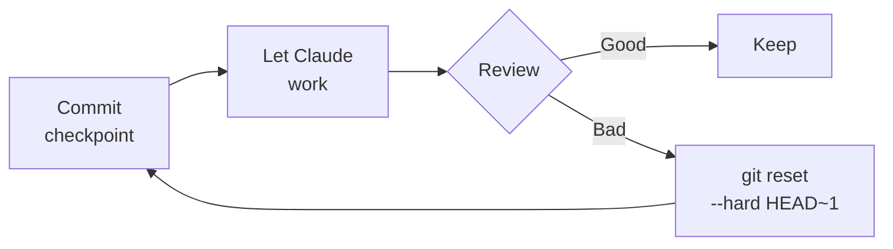
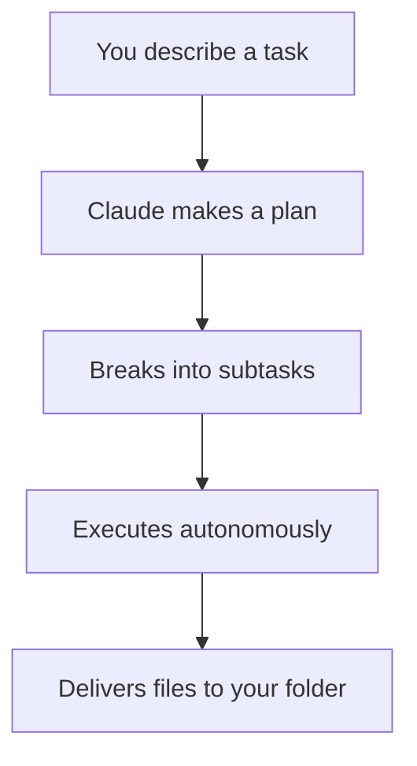

# Session 9: Advanced Patterns & Tips

Week 4 · Technical · 60 min (Session 9 of 11)

<!--
This session is for power users who want to get the most out of Claude Code and the workspace. We cover advanced prompting, the checkpoint-revert pattern, context management, multi-project workflows, cost optimization, Claude Memory import/export, Claude Cowork for non-developers, and common pitfalls to avoid. Practical tips distilled from months of real usage.
-->

---
layout: section
---

# Advanced Prompting

Getting 10x output from the same model

<!--
The difference between average and great Claude Code usage comes down to prompting technique. These patterns come from real team experience and measurable differences in output quality.
-->

---

# The Prompt Formula

<div class="grid grid-cols-2 gap-8">
<div>

### Level 1: Basic

```
> Fix the bug in the login page
```

Claude explores the project, guesses at the issue.

### Level 2: Specific

```
> Fix the login timeout in
  src/auth/session.ts — the TTL is
  hardcoded at 300000ms, should read
  from env.SESSION_TTL
```

Claude goes directly to the file and fixes it.

</div>
<div>

### Level 3: Constrained

```
> Fix the login timeout in
  src/auth/session.ts — the TTL is
  hardcoded at 300000ms, should read
  from env.SESSION_TTL.
  Follow the pattern in
  src/auth/config.ts.
  Add a test in tests/auth/.
```

Claude follows patterns, adds tests, verifies.

### The formula

```
[Action] + [Where] + [Constraints] + [Patterns]
```

> Each level saves tokens and produces better output.

</div>
</div>

<!--
Three levels of prompting quality. Level 1 wastes the most tokens on exploration. Level 2 is specific. Level 3 adds constraints and pattern references. The difference is dramatic—same model, 10x better output. Most people stay at Level 1 or 2. Push yourself to Level 3.
-->

---

# Prompt Patterns That Work

<div class="grid grid-cols-2 gap-8">
<div>

### Pattern: Reference existing code

```
> Add a new API endpoint for /users
  following the pattern in
  src/routes/products.ts
```

### Pattern: Include the error

```
> Fix this error:
  TypeError: Cannot read property
  'map' of undefined
  at UserList.tsx:42
```

### Pattern: Specify the test strategy

```
> Add tests for the payment module.
  Use the same fixtures as
  tests/orders/. Cover: success,
  timeout, duplicate, and refund.
```

</div>
<div>

### Pattern: Scope the change

```
> Refactor extractUser() in
  src/auth/utils.ts to use early
  returns. Don't change the public
  API or any callers.
```

### Pattern: Multi-step with checkpoints

```
> Step 1: Read src/auth/ and explain
  the current auth flow.
  Step 2: Identify where rate limiting
  should be added.
  Step 3: Implement it following
  existing middleware patterns.
```

### Anti-pattern: Marathon sessions

> After 30+ minutes or a topic change, **start a new session**. Context degrades.

</div>
</div>

<!--
These patterns come from real usage. Referencing existing code gives Claude a template. Including the full error eliminates guessing. Specifying test strategy prevents generic tests. Scoping prevents over-engineering. Multi-step prompts guide complex work. And always start fresh when the context gets stale.
-->

---

# The Checkpoint-Revert Pattern

<div class="grid grid-cols-2 gap-8">
<div>

### For experimental work



### The steps

1. **Commit** a clean checkpoint
2. **Let Claude work** — auto-accept everything
3. **Review** the result holistically
4. **Accept** or `git reset --hard HEAD~1` and retry

</div>
<div>

### When to use it

- Exploring new approaches
- Refactoring where the outcome is uncertain
- Prototyping features you might throw away
- Letting Claude attempt something ambitious

### Why it works

- **Restarting fresh beats course-correcting** mid-stream
- Each attempt gets a clean context
- No accumulated mistakes from failed fixes
- Fast iteration: 3 attempts × 5 min > 1 attempt × 30 min

> Think of each attempt as a **slot machine pull** — low cost, high potential.

</div>
</div>

<!--
The checkpoint-revert pattern is one of the most powerful techniques. Instead of trying to guide Claude through a complex change, let it try freely from a clean checkpoint. If it works, great. If not, revert and try a different prompt. Three fast attempts beats one long struggle.
-->

---

# Context Management

<div class="grid grid-cols-2 gap-8">
<div>

### The context budget

Claude Code has ~200K tokens of context. Here's what consumes it:

| Source | Tokens |
|--------|--------|
| System prompt + CLAUDE.md | ~5-10K |
| GitHub MCP schema | ~55K |
| Conversation history | Grows over time |
| File contents read | Varies |
| Tool results | Varies |

### The problem

When context fills up, older messages get **compressed**. Claude loses details from earlier in the session.

</div>
<div>

### Management strategies

| Strategy | Effect |
|----------|--------|
| **CLI over MCP** | 275x less context |
| **Sub-agents** | Research in separate windows |
| **`/compact`** | Compress manually |
| **Focused sessions** | One task = one session |
| **CLAUDE.md** | Skip project rediscovery |

### Rules of thumb

- **30+ minutes** → consider `/compact` or new session
- **Topic change** → always start new session
- **Claude repeating mistakes** → start new session
- **5+ MCP servers** → context bloat alert

> One task = one session. Don't reuse a debugging session for a new feature.

</div>
</div>

<!--
Context management is an underrated skill. The biggest lever: prefer CLI over MCP—275x efficiency difference. Keep sessions focused on one task. Use /compact when things get heavy. And always start fresh when changing topics. Most quality degradation comes from overloaded context.
-->

---

# Multi-Project Workflows

<div class="grid grid-cols-2 gap-8">
<div>

### Working across repositories

```bash
# The workspace links projects
ai-workspace/
├── agent/_projects/
│   ├── frontend/  → ~/code/frontend
│   ├── backend/   → ~/code/backend
│   └── shared/    → ~/code/shared-libs
```

### Best practices

- **One project at a time** — focus sessions
- **Commit in each project** — keep changes isolated
- **Verify all repos clean** before switching
- **Use sub-agents** for cross-project research

</div>
<div>

### Cross-project tasks

```bash
claude
> I need to add a new API field "status"
  to the backend endpoint AND update
  the frontend component that displays
  it. Backend is in agent/_projects/
  backend/src/routes/orders.ts.
  Frontend is in agent/_projects/
  frontend/src/components/OrderCard.tsx.
```

### The OODA loop for complex tasks

| Phase | Action |
|-------|--------|
| **Observe** | Read the request carefully |
| **Orient** | Search session memory first |
| **Decide** | Choose approach + tools |
| **Act** | Execute in small, verified steps |

</div>
</div>

<!--
Multi-project work requires discipline. Focus on one project at a time, commit before switching, and verify all repos are clean. For cross-project changes, be explicit about file paths in both repos. The OODA loop keeps you methodical.
-->

---

# Headless Mode: Claude Code in Scripts & CI

<div class="grid grid-cols-2 gap-8">
<div>

### The `-p` flag

Run Claude Code **non-interactively** — in scripts, CI/CD, or automation pipelines.

```bash
# Basic usage
claude -p "What does the auth module do?"

# With tool permissions
claude -p "Run tests and fix failures" \
  --allowedTools "Bash,Read,Edit"

# Auto-commit staged changes
claude -p "Create a commit for staged changes" \
  --allowedTools "Bash(git diff *),Bash(git commit *)"
```

### Output formats

| Format | Use case |
|--------|----------|
| `text` (default) | Simple scripts |
| `json` | Structured output with metadata |
| `stream-json` | Real-time token streaming |

</div>
<div>

### Use cases

- **CI/CD**: PR reviews, code linting, test generation
- **Git hooks**: Automated commit messages
- **Batch processing**: Analyze multiple files
- **Pipelines**: Chain Claude into shell workflows

### Continue conversations

```bash
# First request
claude -p "Review this codebase"

# Follow up in same session
claude -p "Now focus on the DB queries" \
  --continue
```

### Structured output with schema

```bash
claude -p "Extract function names from auth.py" \
  --output-format json \
  --json-schema '{"type":"object",
    "properties":{"functions":
      {"type":"array",
       "items":{"type":"string"}}}}'
```

> **Agent SDK**: For Python/TypeScript, use the full [Agent SDK](https://platform.claude.com/docs/en/agent-sdk/overview) for programmatic control.

</div>
</div>

<!--
Headless mode turns Claude Code into an automation building block. The -p flag runs a single prompt non-interactively. Combined with --allowedTools and --output-format json, you can integrate Claude into CI/CD pipelines, Git hooks, and batch scripts. The Agent SDK extends this to Python and TypeScript for full programmatic control. This is how you scale Claude Code beyond interactive use.
-->

---

# Cost Optimization

<div class="grid grid-cols-2 gap-8">
<div>

### Where tokens go

| Activity | Relative cost |
|----------|--------------|
| MCP schema loading | Very high (~55K) |
| Reading large files | High |
| Long conversations | Medium-High |
| Exploration (vague prompts) | Medium |
| Focused, specific prompts | Low |

### Quick wins

1. **CLI over MCP** — 275x cheaper per operation
2. **CLAUDE.md** — eliminates rediscovery (saves 20-30%)
3. **Specific prompts** — less exploration
4. **Fresh sessions** — no stale context
5. **Extended thinking** — for complex tasks only

</div>
<div>

### The ROI equation

```
Developer time: $80-150/hour
Claude Code: ~$10-15/day

If Claude saves 1 hour/day:
  ROI = $80-150 / $10-15 = 5-15x
```

### Monitoring

```bash
# Check your usage
claude usage

# Token costs (approximate)
# Input:  ~$3 per 1M tokens
# Output: ~$15 per 1M tokens
```

### The real optimization

> Don't optimize for token cost. Optimize for **developer time**. A $5 session that saves 2 hours is a great deal.

</div>
</div>

<!--
Cost optimization matters but don't over-optimize. The biggest wins come from CLI over MCP, CLAUDE.md, and specific prompts—not from being stingy with tokens. The ROI is clear: even at the high end, Claude Code costs a fraction of the time it saves. Optimize for developer time, not token cost.
-->

---

# Claude Memory: Import & Export

<div class="grid grid-cols-2 gap-8">
<div>

### What is Claude Memory?

Claude (web/desktop) learns your preferences over time — tone, tools, frameworks, coding style, project context.

You can **export** this memory and **import** it elsewhere.

### Why it matters

- **Switching AI providers?** Take your context with you
- **New team member?** Import team preferences instantly
- **Multiple devices?** Sync your preferences manually
- **Backup** your accumulated context

</div>
<div>

### How to export

```
Settings > Capabilities > Memory
> "View and edit your memory"
```

Or ask Claude directly:

```
> Write out your memories of me
  verbatim, exactly as they appear
  in your memory.
```

### How to import

```
Settings > Capabilities > Memory
> "Start import"
> Paste exported text
> "Add to memory"
```

Review imported memories via **"Manage edits"**.

</div>
</div>

> **Note**: Claude prioritizes work-related context. Personal details unrelated to work may not be retained. Memory import/export is available on all plans (Free, Pro, Max, Team, Enterprise).

<!--
Claude Memory import/export lets you transfer your accumulated context between AI providers or devices. Export your preferences, coding style, project context — then import them into a fresh Claude instance or even a different AI. This is especially useful for onboarding new team members: export your team's preferences and have them import it on day one.
-->

---

# Claude Cowork: AI Beyond Code

<div class="grid grid-cols-2 gap-8">
<div>

### What is Cowork?

Claude's agentic capabilities for **knowledge work** — not just coding. Lives in the Claude Desktop app.



### How it works

1. Give Claude access to a **folder** on your computer
2. Describe what you want done
3. Claude reads, edits, and creates files autonomously
4. You review the output

</div>
<div>

### Claude Code vs Cowork

| | Claude Code | Cowork |
|--|------------|--------|
| **Where** | Terminal (CLI) | Desktop app |
| **For** | Developers | Everyone |
| **Setup** | Install + configure | Just open the app |
| **Strength** | Code, git, tests | Docs, research, files |
| **Memory** | CLAUDE.md + workspace | Per-session only |

### What Cowork can do

- Create **Excel files** with working formulas
- Build **PowerPoint** presentations from notes
- **Research** and synthesize web sources into reports
- **Organize** folders, batch rename, process files
- Run **parallel workstreams** for complex tasks

### Availability

> Research preview on **macOS & Windows**. Requires Pro, Max, Team, or Enterprise plan.

</div>
</div>

<!--
Claude Cowork brings agentic AI to non-developers. It's built on the same foundations as Claude Code but lives in the Desktop app with no terminal required. Designers can use it for research and file management. PMs can use it to build reports and presentations. Key difference from Claude Code: Cowork doesn't retain memory between sessions and doesn't have the workspace infrastructure we've built. For developers, Claude Code remains the power tool. For everyone else, Cowork is the gateway to agentic AI.
-->

---

# When to Use What

<div class="grid grid-cols-3 gap-6">
<div>

### Claude Code + Workspace

**Best for**: Development work

- Writing and reviewing code
- Git workflows and PRs
- Test generation
- Debugging with `/debug`
- Session memory across tasks
- Self-improving rules
- Team-shared CLAUDE.md

</div>
<div>

### Claude Cowork

**Best for**: Knowledge work

- Document creation (Excel, PPT)
- Research synthesis
- File organization
- Data analysis
- Non-developer autonomy
- Quick tasks without setup

</div>
<div>

### Claude Web/App + Memory

**Best for**: Conversations

- Brainstorming and ideation
- Learning and explanation
- Quick questions
- Persistent preferences via Memory
- Import/export context between tools

</div>
</div>

<br>

> **The sweet spot**: Use Claude Code for development, Cowork for knowledge work, and Memory import/export to keep your preferences in sync across all three.

<!--
Three tools, three use cases. Claude Code with the workspace is the power tool for development—session memory, self-improvement, hooks, skills. Cowork is for knowledge workers who need agentic file management without the terminal. Claude web/app with Memory is for conversations and brainstorming. Memory import/export bridges them—export your preferences from one, import into another. For our team: developers stick with Claude Code, designers and PMs may find Cowork useful for their non-code tasks.
-->

---

# Common Pitfalls & Fixes

<div class="grid grid-cols-2 gap-8">
<div>

### Pitfall: Marathon sessions

**Symptom**: Claude repeats itself, makes mistakes

**Fix**: Start a new session. One task = one session.

### Pitfall: Over-engineering

**Symptom**: Claude adds abstractions, utils, error handling you didn't ask for

**Fix**: Be explicit: *"Keep it simple. Don't add error handling beyond what's needed."*

### Pitfall: Accepting without review

**Symptom**: Bugs, security issues, wrong patterns in production

**Fix**: Review every change. Treat Claude as a fast junior dev.

</div>
<div>

### Pitfall: Vague prompts

**Symptom**: Claude explores for 5 minutes before starting

**Fix**: Include file paths, patterns, constraints.

### Pitfall: MCP overload

**Symptom**: Slow responses, high cost, context exhaustion

**Fix**: Prefer CLI. Remove MCP servers you don't actively use.

### Pitfall: Fighting bad output

**Symptom**: 30 min trying to fix Claude's approach

**Fix**: `git reset --hard HEAD~1` and retry with a different prompt. Faster.

</div>
</div>

<!--
These pitfalls come from real team experience. The biggest: marathon sessions and accepting without review. Both are easy to fall into. The fix is always the same: keep sessions short, review everything, and revert-retry instead of fighting.
-->

---
layout: center
---

# Live Demo

### Advanced Patterns in Action

<div class="grid grid-cols-5 gap-6">
<div class="col-span-2 text-gray-400 pt-2">

1. Level 1 vs Level 3 prompting — same task, different output
2. **Checkpoint-revert**: commit → attempt → revert → retry
3. Context management: `/compact`, fresh session
4. MCP vs CLI token cost comparison
5. Claude Memory export

</div>
<div class="col-span-3 flex items-center justify-center">


</div>
</div>

<!--
[LIVE DEMO] Five mini-demos. First, show the same task with a vague vs specific prompt. Then demonstrate checkpoint-revert on an experimental change. Show /compact saving a degrading session. Compare the token cost of a GitHub MCP call vs the equivalent gh CLI command. Finally, show Claude Memory export and a quick Cowork demo for file management.
-->

---

# Homework: Level Up

<div class="grid grid-cols-2 gap-8">
<div>

### For everyone (20 min)
1. Pick a task you've done before with Claude Code
2. Rewrite your prompt at **Level 3** (action + where + constraints + patterns)
3. Compare the result to your previous attempt
4. Try the **checkpoint-revert** pattern on something experimental

### For developers
- Audit your MCP servers: `cat .mcp.json`
- Can any be replaced with CLI?
- Try removing one and using CLI instead

</div>
<div>

### For designers & QA
- Practice the Git safety commands:
  - `git checkout .` (undo)
  - `git stash` (save for later)
  - `git stash pop` (restore)
- Do one complete cycle: branch → change → verify → `/commit` → PR

### Reflection question

> *"What's the one habit from this session that would save you the most time if you adopted it consistently?"*

</div>
</div>

<!--
The homework focuses on upgrading existing habits. Better prompts, checkpoint-revert, and MCP auditing are the three highest-impact changes you can make. The reflection question helps people commit to one specific improvement.
-->

---
layout: section
---

# Q&A

Session 9 of 11 complete · Week 4 done! · **Next**: Workshop (Session 10)

<!--
Questions? This session was about optimization and avoiding common traps. Next week is all hands-on: a full workshop exercise followed by the adoption playbook.
-->
