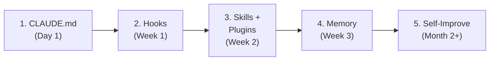
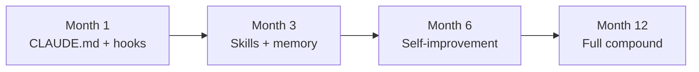

# Session 11: Adoption Playbook & Retrospective

Week 5 · All Audiences · 60 min (Session 11 of 11)

<!--
The final session! We cover the adoption playbook—how to roll this out to your team in phases. Then we do a retrospective on the training itself: what worked, what needs improvement, and what's next. Everyone should come with their homework experience from Session 10.
-->

---
layout: section
---

# Part 1: Adoption Playbook

How to roll this out to your team — in phases

<!--
You've experienced the workspace firsthand over 10 sessions. Now let's talk about how to roll it out systematically in stages, from zero-cost wins to the full self-improving system.
-->

---

# The Adoption Ladder



<div class="grid grid-cols-2 gap-8 pt-4">
<div>

### Phase 1: CLAUDE.md (Day 1)

**Effort: Low · Value: High**

- Add CLAUDE.md to every repo
- Document structure, conventions, commands
- Keep under 200 lines
- > Instant 50%+ improvement.

</div>
<div>

### Phase 2: Hooks (Week 1)

**Effort: Low · Value: High**

- Install code quality hooks
- `block-as-any` — TypeScript safety
- `block-hardcoded-secrets` — Security
- `warn-debug-code` — Clean code
- > Automated guardrails prevent common mistakes.

</div>
</div>

<!--
Start with what's free and high-impact. CLAUDE.md takes 10 minutes and immediately improves output. Hooks take another 10 minutes and catch common mistakes automatically. These two steps alone are worth the entire training.
-->

---

# Adoption: Phases 3-5

<div class="grid grid-cols-3 gap-6">
<div>

### Phase 3: Skills + Plugins

**Effort: Medium · Value: High**

- Create 2-3 domain skills
- Install community plugins
- Connect Figma/Storybook MCPs (designers)
- Share skills across teams

</div>
<div>

### Phase 4: Memory

**Effort: Medium · Value: Compounds**

Choose your strategy:
- **Minimum**: verbose commits + CLAUDE.md
- **Standard**: add Qdrant vector DB
- **Advanced**: full hybrid (semantic + entity + tiered)

</div>
<div>

### Phase 5: Self-Improve

**Effort: Low (after setup) · Value: Compounds**

- Start in `supervised` mode — review weekly
- Switch to `autonomous` once confident
- Monitor with `npm run self:stats`
- Revert any bad rule: `git revert <hash>`

</div>
</div>

<br>

> **For designers**: Start with CLAUDE.md + prototype playbook + Git primer. Add MCPs in Phase 3. Don't overwhelm until basics are solid.

<!--
Phased rollout. Don't try to adopt everything at once. Phase 1-2 in the first week gives immediate value. Phase 3 in week 2 adds domain expertise. Phase 4-5 are for teams ready to invest in compounding intelligence.
-->

---

# Role-Specific Adoption Paths

<div class="grid grid-cols-3 gap-6">
<div>

### Developers

**Week 1**: CLAUDE.md + hooks
**Week 2**: Skills + `/commit`
**Week 3**: Memory search
**Month 2**: Self-improvement

Focus: code quality, productivity, knowledge capture

</div>
<div>

### Designers

**Week 1**: Install Claude Code
**Week 2**: Prototype playbook + Git basics
**Week 3**: Figma MCP
**Month 2**: Design system workflows

Focus: safe code changes, design-code sync

</div>
<div>

### QA Engineers

**Week 1**: Claude Code + CLAUDE.md
**Week 2**: `/debug` + test generation
**Week 3**: Session memory for bug patterns
**Month 2**: systematic-debugging skill

Focus: test coverage, bug investigation

</div>
</div>

<!--
Different roles have different adoption timelines. Developers can move fastest because they're already in the terminal. Designers need more time with Git basics. QA engineers benefit immediately from test generation. Each role has a clear path from basics to advanced usage.
-->

---

# ROI: Where the Value Compounds

<div class="grid grid-cols-2 gap-8">
<div>

### Direct savings

| Metric | Estimate |
|--------|----------|
| Time saved per dev per day | 1-3 hours |
| Cost of AI usage per dev | ~$10-15/day |
| Developer hourly rate | $80-150 |
| **Daily ROI per developer** | **5-30x** |

### Compound effects

- Knowledge retention when people leave
- Faster onboarding for new team members
- Consistent code quality across the team
- Designers making safe code changes directly
- Self-improving rules reduce mistakes over time

</div>
<div>

### The compound curve



> Traditional tools: **linear** value.
> The workspace: **compound** value — every session makes the next one better.

</div>
</div>

<!--
The ROI is clear at every stage. Month 1: immediate productivity. Month 3: skills and memory reduce repeated work. Month 6: self-improvement catches patterns automatically. Month 12: substantial knowledge base. The key insight: the workspace gets more valuable over time, unlike tools with flat value.
-->

---
layout: center
---

# Live Demo

### Phase 1 Adoption in Under 5 Minutes

<div class="grid grid-cols-5 gap-6">
<div class="col-span-2 text-gray-400 pt-2">

1. Copy `CLAUDE.md.example` → edit with your stack
2. Verify hooks are active (`cat .claude/hooks/`)
3. Start Claude Code — see immediate improvement
4. Confirm: same project, dramatically better output

</div>
<div class="col-span-3 flex items-center justify-center">


</div>
</div>

<!--
[LIVE DEMO] Show Phase 1 adoption: copy CLAUDE.md, confirm hooks active, start Claude Code. The whole thing takes under 5 minutes. This makes the "Getting Started Checklist" immediately actionable — everyone can do this today.
-->

---

# Getting Started Checklist

<div class="grid grid-cols-2 gap-8">
<div>

### This week
- [ ] Add `CLAUDE.md` to your main repo
- [ ] Install code quality hooks
- [ ] One real task using Claude Code
- [ ] Designers: prototype playbook + one PR

### This month
- [ ] Create 1-2 domain skills
- [ ] Install community plugins
- [ ] Team decision on memory strategy
- [ ] Review session memory search

</div>
<div>

### This quarter
- [ ] Enable self-improvement (supervised)
- [ ] Create team-specific plugins
- [ ] Designers: full design system workflow
- [ ] Track ROI metrics

### Ongoing
- [ ] Keep CLAUDE.md updated
- [ ] Share skills across teams
- [ ] Monitor CLI/MCP balance
- [ ] Adjust as tools evolve

</div>
</div>

<!--
Actionable checklist. This week is the most important: CLAUDE.md and hooks for everyone, prototype playbook for designers. This month: skills and memory decisions. This quarter: self-improvement and cross-team sharing.
-->

---
layout: section
---

# Part 2: Retrospective

What worked, what didn't, what's next

<!--
Let's reflect on the training itself. You've been through 10 sessions over 5 weeks. What landed? What needs improvement? What questions remain? This feedback shapes future iterations of the training.
-->

---

# Training Retrospective

<div class="grid grid-cols-3 gap-6">
<div>

### What worked well?

Share examples:
- "CLAUDE.md improved my output immediately"
- "The checkpoint-revert pattern saved me hours"
- "Session memory found a past solution"
- "The designer workflow made me more independent"

</div>
<div>

### What was challenging?

Common challenges:
- Docker/Qdrant setup issues
- Git basics for non-developers
- Knowing when to start a new session
- Reviewing AI output effectively

</div>
<div>

### What's still unclear?

Open questions:
- When to use MCP vs CLI?
- How to maintain CLAUDE.md long-term?
- How to measure AI-assisted productivity?
- What's coming next in Claude Code?

</div>
</div>

<br>

> Take 5 minutes to write your answers on sticky notes (or in **#ai-workspace**). Then we'll discuss.

<!--
Take 5 minutes for individual reflection, then 10 minutes for group discussion. This feedback is invaluable for improving the training. Write answers in #ai-workspace so we have a record.
-->

---

# What's Next

<div class="grid grid-cols-2 gap-8">
<div>

### For the team

- **Weekly AI office hours** in #ai-workspace
- **Monthly skill reviews** — share what's working
- **Quarterly training updates** — tools evolve fast
- **CLAUDE.md maintainers** — rotate responsibility

### Resources

- [Awesome Claude Code](https://github.com/hesreallyhim/awesome-claude-code) — 550+ tools
- [GSD Framework](https://github.com/gsd-build/get-shit-done) — orchestration
- [UI/UX Pro Max](https://github.com/nextlevelbuilder/ui-ux-pro-max-skill) — design skill
- [Claude Code docs](https://docs.anthropic.com)

</div>
<div>

### Commands to remember

```bash
# Memory
npm run session:embed
npm run tiered:search "query"
npm run self:stats

# Workspace
/commit
/debug
/session-review
/pr-review

# Safety
git checkout .       # undo all
git stash            # save for later
git reset --hard HEAD~1  # revert last commit
```

### Get help

- Search sessions first!
- Check CLAUDE.md and `/help`
- Ask in **#ai-workspace**

</div>
</div>

<!--
The training ends but the learning continues. Weekly office hours in #ai-workspace keep momentum. Monthly skill reviews share what's working. Quarterly updates reflect tool evolution. And CLAUDE.md maintenance should be a rotating responsibility so it stays fresh.
-->

---

# Final Assignments

<div class="grid grid-cols-2 gap-8">
<div>

### This week (everyone)
1. Add `CLAUDE.md` to your main repo
2. Install 2+ code quality hooks
3. Run one real task through the workspace

### This week (designers)
1. Complete prototype playbook end-to-end
2. Open a PR with a real UI change + screenshots

### This week (QA)
1. Generate tests for one module
2. Get them merged

</div>
<div>

### Group challenge (2 weeks)
- Create **3 skills** for your top domains
- **Verbose commits** for 2 weeks
- Present **top learnings** at standup

### The big question

> *"Six months from now, what's the one thing from this training with the biggest impact?"*

Write it down. Revisit it in 6 months.

### Living document

This training evolves as tools mature. Check **#ai-workspace** for updates.

</div>
</div>

<!--
Take-home assignments ensure the training sticks. The group challenge creates accountability. The living document note acknowledges that tools evolve fast—this training will be updated. The reflection question plants a seed for long-term adoption.
-->

---
layout: center
class: text-center
---

# Thank You!

### The AI Workspace Training Program

<div class="pt-8">

11 sessions · 5 weeks · One team

**You're now equipped to build, customize, and evolve your AI-assisted development workflow.**

</div>

<div class="pt-8 text-sm opacity-75">

**Patricio Perez** · Tech Lead, Node Backend Team

</div>

<!--
That's a wrap! You've gone from LLM fundamentals to self-improving agents, designer workflows, MCP vs CLI trade-offs, and multi-agent orchestration. The key takeaway: start simple, build up incrementally, and let the compound effects do their work. Thank you all for participating!
-->

---
layout: section
---

# Q&A

Session 11 of 11 — Training Complete!

<!--
Final Q&A. Common closing questions: "What's the best first step?" (CLAUDE.md for devs, prototype playbook for designers), "How do we measure success?" (Track time saved, rule count, PRs from designers), "What's next?" (Weekly office hours, monthly skill reviews, evolving fast).
-->
